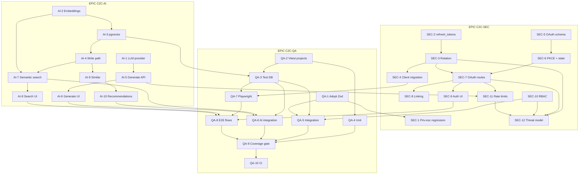

# Jira Backlog — Thesis Upgrade (`iteh-c2c-ecommerce`)

Backlog for the three planned enhancements from `PLAN-DIPLOMSKI.txt`:
AI integration, OAuth2 authentication, and comprehensive testing.

**Target Jira project key:** `C2C` (rename the IDs below if your key differs)
**Baseline branch:** `develop`
**App root:** `c2c-e-commerce/` (the repo-root `package.json` is vestigial)

---

## 0. How to read this document

### Issue hierarchy

```
Epic  (C2C-AI / C2C-SEC / C2C-QA)
 └── Story  (one deployable slice, 1–13 points)
      └── Sub-tasks  (listed inline as a checklist inside each story)
```

Every story is independently mergeable. Where that is not true, the story carries a
`Depends on` field and the dependency graph in §5 shows the ordering.

### Field conventions

| Field | Values used here |
|---|---|
| **Type** | Story, Bug, Task (enabler), Spike |
| **Priority** | Highest / High / Medium / Low |
| **Points** | Fibonacci: 1, 2, 3, 5, 8, 13 |
| **Labels** | `ai`, `pgvector`, `oauth2`, `security`, `testing`, `ci`, `frontend`, `backend`, `db-migration`, `thesis`, `enabler`, `spike` |
| **Component** | `api`, `db`, `web`, `infra` |

### Implementation method — spec → plan → implementation, test-first

**Every story in this backlog is implemented as TDD, in three named phases, in order.**
This is not a style preference: the acceptance criteria below are written to be
executable, and writing them as tests *before* the implementation is the only thing that
stops "AC7 is satisfied" from becoming an opinion. A story whose tests were written after
its implementation has not met its Definition of Done, no matter how green the suite is.

| Phase | Produces | Leaves the working tree | Done when |
|---|---|---|---|
| **1. Spec** | The behaviour, restated as failing tests | Red | Every AC in the story maps to at least one named test, and each one fails **for the right reason** — asserting real behaviour, not a missing import |
| **2. Plan** | The implementation approach, written down before code — **outside the repo** | Still red | The files to add/change, the chosen design and the rejected alternative, and any AC that needs a design decision are recorded in the Jira story's comments or an untracked scratch file |
| **3. Implementation** | The smallest code that turns the spec green | Green | The whole suite passes, and no test was weakened, skipped, or deleted to get there |

Rules that make the three phases mean something:

- **Name tests after their AC.** `it("AC6: replaying a rotated refresh token revokes the whole family")`. A reviewer reading a failure must be able to jump straight to the criterion it violates, and the thesis can cite the mapping.
- **Red before green, per AC — not per story.** Run the new test and *watch it fail* before writing the code that satisfies it. A test that has never been observed failing has not been shown to test anything.
- **Never edit spec and implementation in the same commit.** Commit the failing tests first (`test(sec-3): spec for rotation and reuse detection`), then the code that turns them green (`feat(sec-3): rotating refresh tokens`). The diff pair is the evidence that the order was followed, and it is what makes the practice auditable in the thesis.
- **A bug gets a failing regression test first.** SEC-1 is the model: reproduce the defect as a red test, then fix it. That is why it is written up as a Bug rather than quietly patched.
- **If an AC cannot be expressed as a test, fix the AC.** §0's acceptance-criteria rule already says so — the spec phase is where that gets discovered, while changing it is still cheap.
- **Enablers are specified the same way.** A provider interface or a test harness gets its own tests (contract tests against the mock, a self-check test for the harness) before the real implementation exists.
- **Refactoring is the fourth, optional beat.** Once green, clean up — but the suite stays green throughout, and no assertion changes.

Where a story's own **Definition of Done** or **Test notes** name specific tests, those are
the minimum spec-phase output, not the total.

### Commit hygiene

Rules for anyone — human or AI assistant — producing commits against this backlog.

**Process documents are never committed.** The plan from phase 2, spec write-ups, story
breakdowns, session notes, status reports, migration checklists and any similar scratch
output stay **out of the repository**. They belong in the Jira story's comments, or in an
untracked local file. The repository records *what the software is*, not the working notes
of how it got there — a reviewer reading `git log` should see behaviour changing, not a
parallel narrative about the work.

Do not confuse this with the **spec phase**, which is failing *tests*. Those are source
code and are always committed — committing them red is the entire point (see the rules
above). "Don't commit the spec" means the prose document, never the test file.

The exception is documentation the backlog names as a **deliverable of a story**, which is
product output and is committed like any other artefact:

| Committed — it is the deliverable | Not committed — it is process |
|---|---|
| `docs/security/rbac-matrix.md` (SEC-10) | The plan for how to audit the routes |
| `docs/security/threat-model.md` (SEC-12) | A summary of what changed this session |
| `README.md`, `.env.example`, `@swagger` JSDoc | A checklist of remaining stories |
| This backlog | A spec write-up restating a story's AC in prose |

If it is not listed in a story's **Scope — in**, it is not a deliverable.

**Commit authorship is the human's alone.** An AI assistant working on this repository
must **not** add itself as an author or co-author of any commit:

- No `Co-Authored-By:` trailer naming Claude, an assistant, or a tool
- No "Generated with…" or "🤖" attribution line in commit messages or PR bodies
- `git config user.name` / `user.email` stay set to the human author throughout

The commit history is a thesis artefact and part of its authorship record; it names the
person accountable for the change. Where an assistant's involvement is worth stating, it
belongs in the thesis methodology chapter — described honestly and in full — not
distributed one line at a time across several hundred commit trailers.

Commit messages themselves stay conventional and scoped to the story:
`test(sec-3): spec for rotation and reuse detection`, then
`feat(sec-3): rotating refresh tokens with reuse detection`.

### Global Definition of Done

Applies to **every** story below. Story-level "Definition of Done" sections list only
the *additional* items on top of this.

- [ ] The story followed **spec → plan → implementation**: tests were committed red, before the code that turned them green
- [ ] Every acceptance criterion has at least one test named after it, and no AC is verified by inspection alone
- [ ] `npx tsc --noEmit` is clean
- [ ] `npm run lint` is clean
- [ ] `npx vitest run` passes (132/132 as of 2026-08-26 — never merge a red suite)
- [ ] `npm run build` succeeds
- [ ] New/changed API routes have updated `@swagger` JSDoc and `/api-docs` renders them
- [ ] New environment variables are added to `.env.example` **and** documented in `README.md`
- [ ] No secret is committed; new secrets are registered as GitHub Actions secrets
- [ ] No process documents (plans, spec write-ups, session notes) were committed — only the deliverables named in **Scope — in**
- [ ] Every commit is authored by the human alone: no AI co-author trailer, no generated-by attribution
- [ ] Reviewed by at least one other person, squash-merged into `develop`
- [ ] Anything worth citing in the thesis is noted in the story's comments

### Acceptance-criteria style

AC are written **Given / When / Then** and are numbered so reviewers and testers can
reference them (`AC3 fails`). Each AC is independently verifiable — if you cannot write
a test for it, it is not an AC, it is a note.

---

## 1. Decisions already made

These were settled before writing the backlog. They are recorded here because the
stories assume them; changing one invalidates specific stories, noted in the last column.

| # | Decision | Rationale | Invalidates if changed |
|---|---|---|---|
| D1 | **LLM = Groq API**, open-source weights (`qwen/qwen3.8-27b`), OpenAI-compatible endpoint | Open-source model without shipping a 4 GB container; free tier is sufficient for a thesis demo | AI-1, AI-5 |
| D2 | **Embeddings = Transformers.js in-process**, `Xenova/all-MiniLM-L6-v2`, **384 dimensions**, mean-pooled + L2-normalised | No API key, works offline, demo runs anywhere. Fixes the pgvector column width at 384 | AI-2, AI-3, AI-4 |
| D2a | The npm package is **`@huggingface/transformers` 4.2.0**, not `@xenova/transformers` 2.17.2 as AI-2's scope originally said | Same author, same runtime, same model — the project moved into the Hugging Face org in 2024. The abandoned fork pins an `onnxruntime-node` predating Node 22, which this project runs. D2's substance is unchanged | AI-2 |
| D3 | **OAuth2 = hand-rolled authorization-code flow**, not Auth.js | Keeps the existing custom JWT layer and `authenticate()`/`authorize()` guards intact; the protocol itself becomes a thesis chapter | SEC-5 … SEC-9 |
| D4 | **Recommendations use existing data only** — orders + reviews. No `listing_views` table | Zero new tracking, works with seeded data. Cold-start falls back to category popularity | AI-9 |
| D5 | ~~Access token in memory (15 min)~~ → **superseded by D5a** | — | — |
| D5a | **Both tokens in httpOnly cookies**: a 15-minute access token in `auth_token` (`Path=/`) plus a rotating refresh token in `refresh_token` (`Path=/api/auth`), with reuse detection | D5 was decided when the access token still lived in `localStorage`, and its stated rationale was removing that XSS vector. The vector was closed early by the cookie migration (commit `8889f45`), so holding the token in JS memory would now *reintroduce* script-readable credentials rather than remove them. Rotation, reuse detection and family revocation — the parts the thesis chapter is about — are unaffected | SEC-3, SEC-4 |
| D6 | **Test DB = GitHub Actions service container in CI, Testcontainers locally**, image `pgvector/pgvector:pg16` | Fast in CI, zero-setup locally, one code path behind `getTestDb()` | QA-3, QA-5, QA-6 |
| D7 | **In scope:** rate limiting. **Out of scope:** AI moderation/auto-categorisation (§1.3), 2FA (§2.4), realtime chat (§4) | Keeps the thesis core tight; deferred items are listed in §6 | — |
| D8 | Semantic search is **additive**: `GET /api/listings` gains a `mode` parameter defaulting to `keyword`, so existing clients are unaffected | Backwards compatibility; lets A/B comparison of keyword vs. semantic go in the thesis evaluation chapter | AI-6, AI-7 |
| D9 | OAuth account linking requires a **verified** provider email **and** password re-authentication | Auto-linking on unverified email is a well-known account-takeover vector | SEC-8 |
| D10 | Coverage gate: **70%** lines/functions/statements, **60%** branches, scoped to `src/lib/**` and `src/app/api/**` | Achievable from the current baseline without writing filler tests for UI glue | QA-9 |

> **Open question raised during AI-3 (2026-08-26), blocking AI-4 AC5.** AI-4 specifies the
> backfill as `embedding IS NULL OR embedding_updated_at < updated_at`, and AI-3's
> technical note gives `embedding_updated_at` the same purpose. **No table in this schema
> has an `updated_at` column** — `grep` over `src/db/schema/` and `drizzle/*.sql` finds only
> `created_at`. That query cannot be written as specified.
>
> AI-3 did not fix it: its scope names exactly two columns and the story had to stay
> independently mergeable. AI-4 must choose one of:
>
> 1. **Add `updated_at` to `listings`** in its own migration, with a trigger or an explicit
>    write in the `PUT` handler. Matches the spec, costs a migration, and gives the thesis a
>    real audit trail.
> 2. **Compare against `created_at`** — wrong for any edited listing, which is exactly the
>    case staleness detection exists for. Not recommended.
> 3. **Set `embedding_updated_at = NULL` whenever the text changes** and treat NULL as
>    "needs embedding". No migration, and the backfill collapses to `embedding IS NULL` —
>    but it discards the record of when a vector was last computed.

> **D1 amended 2026-08-26 (during AI-1).** The original model,
> `llama-3.3-70b-versatile`, has been decommissioned by Groq: it is absent from
> `GET /openai/v1/models` on the project's key and a completion request answers 404. This
> is **risk R3 materialising**, and the mitigation held — `LLM_PROVIDER` / `GROQ_MODEL`
> confined the change to one constant and one spec assertion.
>
> `qwen/qwen3.8-27b` replaces it, chosen over the two other viable open-weights candidates
> the account serves:
>
> | Model | Latency | Words | Note |
> |---|---|---|---|
> | `qwen/qwen3.8-27b` | 473 ms | 56 | Plain completion; kept to the brief |
> | `openai/gpt-oss-120b` | 671 ms | 57 | Reasoning model; invented specifications |
> | `openai/gpt-oss-20b` | 609 ms | 60 | Reasoning model; 246 of 325 tokens on reasoning |
>
> Both `gpt-oss` models return **empty `content`** at `max_tokens: 300`, having spent the
> budget in the reasoning channel; they need `reasoning_effort: "low"` and a far larger
> cap. That conflicts directly with AI-5's requirement to cap `max_tokens` against runaway
> generation, which would have silently produced blank descriptions. `qwen` needs no such
> special case. Both models named in AI-1's spec are ones the account can actually serve.

---

## 2. Work already in flight (read before starting)

A parallel backend session has **uncommitted** changes on `develop`. These overlap the
security epic and the stories below are already scoped around them. Verify with
`git diff` before you start.

| Already done (uncommitted) | Effect on this backlog |
|---|---|
| `src/app/api/auth/register/route.ts` — role whitelist restored; self-registration can no longer create an `admin` | The privilege-escalation bug is **fixed**. SEC-1 is reduced to regression-testing it and moving the check into Zod |
| `src/lib/rate-limit.ts` — new in-memory sliding-window limiter + `getClientIp()` + `LOGIN_RATE_LIMIT` / `REGISTER_RATE_LIMIT` | SEC-11 no longer builds a limiter; it **extends** this one to the AI and OAuth endpoints |
| `src/lib/response.ts` — `jsonError()` accepts `429` and custom headers | `Retry-After` support already exists |
| `src/lib/auth.ts` — JWT algorithm pinned to `HS256` on both sign and verify | Algorithm-confusion hardening already done; SEC-3 builds on it |
| `src/app/api/listings/route.ts` — `GET` no longer requires auth, and `?sellerId=` no longer leaks other sellers' `sold`/`removed` inventory | AI-6 must rebase on this rewritten filter block, not the old one |
| `FRONTEND-TASKS.md` — a parallel **frontend** session is extracting `useFetch`, `ErrorAlert`, `EmptyState`, `StatusBadge`, `CurrencySelect`, and splitting `seller/page.tsx` | All `web` stories below should **consume** those components rather than re-inventing them. Coordinate merge order: frontend refactor lands first |

> **`src/lib/validation.ts` is still dead code.** It contains a complete set of Zod
> schemas — including `RegisterBodySchema` with `role: z.enum(["buyer","seller"])`,
> exactly the fix that was just hand-rolled inline — but `grep` shows it is imported by
> nothing except its own test file. QA-1 wires it in.

---

## 3. Epics

### EPIC C2C-AI — AI-Assisted Marketplace

> **Goal:** A seller can generate a listing description from a title and keywords, and a
> buyer can find listings by meaning rather than by exact keyword, with "similar
> listings" and "recommended for you" surfaces driven by vector embeddings.
>
> **Business value:** This is the technical core of the thesis. It is what distinguishes
> the diploma work from the seminar work.
>
> **Success metrics:**
> - Semantic search returns a relevant result for at least 8 of 10 hand-written natural-language queries where the current `ilike` search returns zero rows
> - Description generation completes in < 5 s at p95
> - `GET /api/listings?mode=hybrid` p95 latency stays under 400 ms with 1 000 seeded listings
>
> **Points:** 55 · **Stories:** 10

---

#### C2C-AI-1 — Enabler: pluggable LLM provider with a deterministic mock

| | |
|---|---|
| **Type** | Task (enabler) |
| **Priority** | Highest |
| **Points** | 3 |
| **Labels** | `ai`, `backend`, `enabler` |
| **Component** | `api` |
| **Depends on** | — |
| **Blocks** | AI-5, QA-6, QA-8 |

**Description**

Every later AI story needs to call a language model, and CI must never call a paid,
rate-limited, non-deterministic external API. Introduce a single interface with a Groq
implementation for real use and a mock implementation for tests, selected by environment
variable. This is the seam that makes the whole epic testable.

**Scope — in**

- `src/lib/ai/llm.ts`: `LlmProvider` interface with `generate(prompt: string, opts): Promise<string>`
- `GroqProvider` — `POST https://api.groq.com/openai/v1/chat/completions`, model from `GROQ_MODEL` (default `qwen/qwen3.8-27b` — see the D1 amendment), `AbortSignal` timeout, typed error on non-2xx
- `MockProvider` — returns a deterministic string derived from the prompt; no network
- `getLlmProvider()` factory reading `LLM_PROVIDER` (`groq` | `mock`)
- Env: `LLM_PROVIDER`, `GROQ_API_KEY`, `GROQ_MODEL`, `LLM_TIMEOUT_MS`

**Scope — out**

- Any HTTP route (AI-5 adds the first one)
- Streaming responses
- Ollama support (deferred, §6)

**Technical notes**

Groq is OpenAI-compatible, so the request body is
`{ model, messages: [{role, content}], temperature, max_tokens }` and the answer is at
`choices[0].message.content`. Free-tier limits are roughly 30 requests/minute — the
timeout and the typed error matter. Missing `GROQ_API_KEY` must fail loudly at provider
construction, matching how `getJwtSecret()` already behaves in `src/lib/auth.ts`.

**Acceptance criteria**

1. **Given** `LLM_PROVIDER=mock`, **when** `getLlmProvider().generate("x")` is called, **then** it resolves without any network request and returns the same string for the same input every time.
2. **Given** `LLM_PROVIDER=groq` and a valid `GROQ_API_KEY`, **when** `generate()` is called, **then** a completion string is returned from the Groq API.
3. **Given** `LLM_PROVIDER=groq` and a missing `GROQ_API_KEY`, **when** the provider is constructed, **then** it throws an error naming the missing variable — it does **not** silently fall back to the mock.
4. **Given** the Groq API returns a non-2xx status, **when** `generate()` is called, **then** it rejects with a typed `LlmError` carrying the upstream status code, and the raw API key never appears in the message or in any log line.
5. **Given** the Groq API does not respond within `LLM_TIMEOUT_MS`, **when** `generate()` is called, **then** the request is aborted and rejects with a timeout `LlmError`.
6. **Given** `LLM_PROVIDER` is unset, **when** the factory runs, **then** it defaults to `mock` in `NODE_ENV=test` and to `groq` otherwise.

**Test notes**

Unit tests only — stub `global.fetch`. No live Groq calls in CI, ever.

**Definition of Done (additional)**

- [ ] `.env.example` lists all four new variables with safe placeholder values
- [ ] `README.md` explains how to obtain a free Groq API key

---

#### C2C-AI-2 — Enabler: local embedding service (Transformers.js, 384-dim)

| | |
|---|---|
| **Type** | Task (enabler) |
| **Priority** | Highest |
| **Points** | 5 |
| **Labels** | `ai`, `backend`, `enabler` |
| **Component** | `api` |
| **Depends on** | — |
| **Blocks** | AI-4, AI-7, AI-9, AI-10 |

**Description**

Produce 384-dimension vectors from arbitrary text, in-process, with no API key. This is
the other half of the seam: everything vector-related depends on it, and tests depend on
being able to swap it for something deterministic.

**Scope — in**

- `src/lib/ai/embeddings.ts`: `EmbeddingProvider` with `embed(text: string): Promise<number[]>` and `embedBatch(texts: string[]): Promise<number[][]>`
- `LocalEmbeddingProvider` — `@xenova/transformers` `pipeline("feature-extraction", "Xenova/all-MiniLM-L6-v2")`, called with `{ pooling: "mean", normalize: true }`
- Module-level singleton so the ~25 MB model is loaded once per process, plus a `warmup()` used at server start
- `MockEmbeddingProvider` — deterministic pseudo-vector derived from a hash of the input, L2-normalised, same 384 dimensions
- `EMBEDDING_DIMENSIONS = 384` exported as the single source of truth
- Next.js config: add `@xenova/transformers` to `serverExternalPackages`
- Dockerfile: pre-download the model at build time so containers do not fetch it at first request

**Scope — out**

- Persisting vectors (AI-3)
- Any query using them (AI-6, AI-8, AI-9)

**Technical notes**

`normalize: true` gives unit vectors, which makes cosine distance and inner product
equivalent and keeps the pgvector index choice simple. The output tensor is accessed via
`Array.from(output.data)`. Cold start on CPU is roughly 1–3 s for model load and
100–300 ms per embed — hence `warmup()`. The `MockEmbeddingProvider` must be
*deterministic and different per input*, otherwise ranking tests in QA-6 cannot assert an
order.

**Acceptance criteria**

1. **Given** the local provider, **when** `embed("iPhone 15 Pro")` is called, **then** it returns exactly 384 finite numbers.
2. **Given** any returned vector, **when** its L2 norm is computed, **then** it is 1.0 ± 0.001.
3. **Given** two semantically close texts ("used mountain bike", "second-hand bicycle for trails") and one unrelated text ("leather office chair"), **when** cosine similarity is computed, **then** the similarity of the close pair is strictly greater than either text's similarity to the unrelated one.
4. **Given** `embed()` is called twice with identical input in the same process, **then** the two vectors are identical.
5. **Given** `embedBatch()` with N texts, **then** it returns N vectors in input order, and takes measurably less time than N sequential `embed()` calls.
6. **Given** `EMBEDDING_PROVIDER=mock`, **when** `embed()` is called, **then** no model is loaded, no file is read, and AC1/AC2/AC4 still hold.
7. **Given** the Docker image is built, **when** a container starts with no network access, **then** the first `embed()` call still succeeds from the baked-in model cache.

**Test notes**

AC3 is the one test that must run against the *real* model — mark it and let it run in
the unit suite; it is slow (~3 s) but it is the only proof the embeddings mean anything.

---

#### C2C-AI-3 — pgvector: extension, `listings.embedding` column, HNSW index

| | |
|---|---|
| **Type** | Story |
| **Priority** | Highest |
| **Points** | 5 |
| **Labels** | `ai`, `pgvector`, `db-migration`, `infra` |
| **Component** | `db`, `infra` |
| **Depends on** | AI-2 (dimension constant) |
| **Blocks** | AI-4, AI-7, AI-9, AI-10, QA-3 |

**Description**

Give Postgres the ability to store and index 384-dimension vectors, and make every
environment — local compose, CI, and Railway — run an image that has the extension.

**Scope — in**

- Migration `0005_enable_pgvector.sql`: `CREATE EXTENSION IF NOT EXISTS vector;` (hand-written — `drizzle-kit` will not generate it)
- Migration `0006_add_listing_embedding.sql`: add `embedding vector(384)` (nullable) and `embedding_updated_at timestamp` to `listings`; create the HNSW index
- Drizzle schema: `vector("embedding", { dimensions: 384 })` + index declaration in `src/db/schema/listings.ts`
- Swap `postgres:16-alpine` → `pgvector/pgvector:pg16` in `docker-compose.yml` and `docker-compose.dev.yml`
- Confirm the Railway Postgres instance can run `CREATE EXTENSION vector`

**Scope — out**

- Populating the column (AI-4)

**Technical notes**

```sql
CREATE INDEX listings_embedding_hnsw_idx
  ON listings USING hnsw (embedding vector_cosine_ops);
```

The column stays **nullable** on purpose: a listing must remain creatable when the
embedding step fails (see AI-4). HNSW over IVFFlat because it needs no training step and
no minimum row count — correct for a dataset that starts near-empty. `embedding_updated_at`
exists so a stale-embedding backfill can find rows whose text changed after their vector
was written.

**Risk:** if the managed Railway Postgres does not expose `pgvector`, this story is
blocked. Time-box a 2-hour check as the first sub-task; if it fails, fall back to a
Railway-hosted `pgvector/pgvector:pg16` container and record the change in the thesis
deployment chapter.

**Acceptance criteria**

1. **Given** a fresh database, **when** `npm run db:migrate` runs, **then** it completes with no error and `SELECT * FROM pg_extension WHERE extname = 'vector'` returns one row.
2. **Given** migrations have run, **when** the `listings` table is inspected, **then** `embedding` exists with type `vector(384)` and is nullable, and `embedding_updated_at` exists.
3. **Given** migrations have run, **when** `\d listings` is inspected, **then** `listings_embedding_hnsw_idx` exists and uses `hnsw` with `vector_cosine_ops`.
4. **Given** migrations are applied twice to the same database, **then** the second run is a no-op and does not error.
5. **Given** the existing seed data, **when** `npm run db:seed` runs after migrating, **then** it still succeeds.
   *(Superseded in part: the criterion originally read "with `embedding` left `NULL`", describing the seed as it
   stood at AI-3. The seed now embeds as it inserts — leaving the vectors NULL meant a freshly seeded database
   had no semantic search at all. The "still succeeds" requirement is unchanged and still tested.)*
6. **Given** `docker compose -f docker-compose.dev.yml up`, **then** the `db` service reports healthy and the app connects, with no manual step needed to install the extension.
7. **Given** the deployed Railway environment, **when** the migration job runs, **then** AC1 holds there too.

**Definition of Done (additional)**

- [ ] `README.md` migration table gains rows 0005 and 0006
- [ ] The Railway `pgvector` availability finding is recorded in the story comments (thesis input)

---

#### C2C-AI-4 — Write path: embed listings on create and update, plus a backfill script

| | |
|---|---|
| **Type** | Story |
| **Priority** | High |
| **Points** | 5 |
| **Labels** | `ai`, `pgvector`, `backend` |
| **Component** | `api`, `db` |
| **Depends on** | AI-2, AI-3 |
| **Blocks** | AI-7, AI-9, AI-10 |

**Description**

Keep `listings.embedding` in sync with listing text. Every listing that exists — old or
new — needs a vector, or it is invisible to semantic search.

**Scope — in**

- `src/lib/ai/listing-embedding.ts`: `buildEmbeddingText(listing)` → `` `${title}\n\n${description}` `` (single definition, used by write path *and* backfill, so they can never disagree)
- `POST /api/listings` and `PUT /api/listings/[id]`: compute and store the embedding
- Skip re-embedding on `PUT` when neither `title` nor `description` changed
- `npm run db:backfill-embeddings` — batches rows where `embedding IS NULL` or `embedding_updated_at < updated_at`, uses `embedBatch`, logs progress, is safely re-runnable

**Scope — out**

- Background queue / worker (deferred, §6 — synchronous is acceptable at this scale and is simpler to defend in the thesis)

**Technical notes**

**Embedding failure must never fail the write.** Wrap the embed call, log the error,
insert with `embedding = NULL`, and let the backfill script pick it up later. A seller
losing their listing because Transformers.js threw is a far worse outcome than a listing
that is temporarily unsearchable by meaning — it is still fully keyword-searchable.

This adds 100–300 ms to listing creation. That is acceptable; note the measured figure in
the story comments for the thesis performance section.

**Acceptance criteria**

1. **Given** an authenticated seller, **when** they `POST /api/listings` with a valid body, **then** the response is 201 and the stored row has a non-null 384-dim `embedding` and a set `embedding_updated_at`.
2. **Given** the embedding provider throws, **when** the same request is made, **then** the response is still **201**, the listing exists with `embedding = NULL`, and the failure is logged once with the listing id.
3. **Given** an existing listing, **when** its `title` or `description` is changed via `PUT`, **then** the embedding is recomputed and `embedding_updated_at` advances.
4. **Given** an existing listing, **when** only its `price`, `status`, `imageUrl` or `categoryId` is changed via `PUT`, **then** the embedding and `embedding_updated_at` are unchanged and no embed call is made.
5. **Given** rows with `embedding IS NULL`, **when** `npm run db:backfill-embeddings` runs, **then** every such row ends with a non-null embedding and the script prints a processed/skipped/failed summary.
6. **Given** the backfill script is run a second time with no new rows, **then** it processes 0 rows and exits 0.
7. **Given** a listing whose title contains only whitespace after trimming, **when** it is embedded, **then** the description alone is used and no empty-string embed call is made.

**Test notes**

Integration tests (QA-6) against the real test DB with the mock embedding provider.
AC2 needs a provider stub that throws.

---

#### C2C-AI-5 — `POST /api/listings/generate-description`

| | |
|---|---|
| **Type** | Story |
| **Priority** | High |
| **Points** | 5 |
| **Labels** | `ai`, `backend` |
| **Component** | `api` |
| **Depends on** | AI-1 |
| **Blocks** | AI-6, QA-8 |

**Description**

A protected endpoint that turns a product title plus optional keywords into a marketplace
description a seller can edit and use.

**Scope — in**

- New route, method `POST`, path `/api/listings/generate-description`
- Auth: `authenticate()` + `authorize("seller", "admin")`
- Zod body schema `GenerateDescriptionSchema` added to `src/lib/validation.ts`: `{ title: string (3–120), keywords?: string[] (max 10, each ≤ 30 chars), categoryName?: string, language?: "en" | "sr" (default "en") }`
- Prompt template in `src/lib/ai/prompts.ts`, versioned with a constant so thesis results are reproducible
- Response: `{ description: string, model: string, generatedAt: string }`
- Rate limit via the existing `src/lib/rate-limit.ts` (see SEC-11)
- Full `@swagger` JSDoc

**Scope — out**

- Saving the listing (the client posts the edited text to the normal create route)
- Image generation, translation of existing listings

**Technical notes**

Constrain the model in the system prompt: 60–120 words, plain text (no markdown), no
invented specifications, no invented price, no contact details. Cap `max_tokens` so a
runaway generation cannot burn quota. Truncate the returned text defensively at 2 000
characters before responding.

**Acceptance criteria**

1. **Given** an authenticated seller, **when** they POST `{ "title": "Mountain bike", "keywords": ["26 inch","aluminium"] }`, **then** the response is 200 with a non-empty `description` and the `model` field naming the model used.
2. **Given** an anonymous caller, **when** they POST to this route, **then** the response is 401 and no LLM call is made.
3. **Given** an authenticated **buyer**, **when** they POST to this route, **then** the response is 403 and no LLM call is made.
4. **Given** a body missing `title`, or with a title shorter than 3 characters, **when** POSTed, **then** the response is 400 with a message naming the offending field.
5. **Given** a body with 11 keywords, **when** POSTed, **then** the response is 400.
6. **Given** the LLM provider rejects (upstream error or timeout), **when** the route runs, **then** the response is **502** with a generic message, and the upstream error and API key are absent from the response body.
7. **Given** the caller exceeds the AI rate limit, **when** they POST again, **then** the response is 429 with a `Retry-After` header.
8. **Given** the generated text exceeds 2 000 characters, **then** the response body is truncated to 2 000 characters.
9. **Given** the endpoint exists, **when** `/api-docs` is opened, **then** it is listed under the `Listings` tag with request schema and the 200/400/401/403/429/502 responses documented.

---

#### C2C-AI-6 — AI description button in the listing form

| | |
|---|---|
| **Type** | Story |
| **Priority** | Medium |
| **Points** | 3 |
| **Labels** | `ai`, `frontend` |
| **Component** | `web` |
| **Depends on** | AI-5 · **Coordinate with** `FRONTEND-TASKS.md` Task 6b (`ListingForm.tsx` extraction) |
| **Blocks** | QA-8 |

**Description**

Let the seller generate a description from inside the create/edit form, review it, and
edit it before saving. The AI writes a draft; the human still ships it.

**Scope — in**

- "✨ Generate with AI" button next to the description field in `ListingForm.tsx`
- Optional keywords input feeding the request
- Loading, error, and disabled states; button disabled while `title` is under 3 characters
- Generated text populates the description textarea and remains fully editable
- Confirmation prompt before overwriting a non-empty description
- A visible note that the description was AI-assisted

**Scope — out**

- Regenerate-variants UI, tone/length pickers

**Technical notes**

Land **after** the frontend refactor in `FRONTEND-TASKS.md`, and build on the extracted
`ListingForm.tsx`, `ErrorAlert`, and `Button` primitives instead of adding another inline
error banner — the refactor exists specifically to stop that duplication.

**Acceptance criteria**

1. **Given** a seller on `/listings/new` with a title of at least 3 characters, **when** they click "Generate with AI", **then** a loading state appears and the returned description fills the textarea.
2. **Given** the description textarea already has text, **when** the seller clicks generate, **then** they are asked to confirm before it is overwritten, and cancelling leaves the text untouched.
3. **Given** the generation succeeded, **when** the seller edits the generated text and submits, **then** the edited text is what is saved.
4. **Given** the API returns 429 or 502, **when** generation is attempted, **then** an `ErrorAlert` shows a human-readable message, the textarea is unchanged, and the button becomes clickable again.
5. **Given** the title field is empty or under 3 characters, **then** the generate button is disabled with a tooltip explaining why.
6. **Given** a request is in flight, **then** the button is disabled so a double click cannot fire two requests.
7. **Given** a buyer somehow reaches the form, **then** the button is not rendered.
8. **Given** any viewport from 375 px wide upward, **then** the button and keywords input lay out without overflow.

---

#### C2C-AI-7 — Semantic and hybrid search on `GET /api/listings`

| | |
|---|---|
| **Type** | Story |
| **Priority** | Highest |
| **Points** | 8 |
| **Labels** | `ai`, `pgvector`, `backend` |
| **Component** | `api` |
| **Depends on** | AI-2, AI-3, AI-4 |
| **Blocks** | AI-8, QA-6 |

**Description**

The main technical contribution: let buyers search by meaning. `search=warm jacket for
winter` should surface a listing titled "Insulated parka, size L" that the current `ilike`
query cannot find.

**Scope — in**

- New `mode` query parameter on `GET /api/listings`: `keyword` (default) | `semantic` | `hybrid`
- `semantic`: embed the query, order by cosine distance, apply a `MIN_SIMILARITY` floor
- `hybrid`: run keyword and semantic independently, fuse with Reciprocal Rank Fusion (`k = 60`)
- All existing filters (`categoryId`, `sellerId`, `minPrice`, `maxPrice`, `status`) still apply in every mode
- Pagination still returns `{ data, total, page, limit, totalPages }`
- Each row gains an optional `similarity` number in semantic/hybrid modes
- Extract the query building into `src/lib/listings-query.ts` — the route handler is already long and this story would push it past readable

**Scope — out**

- Query spell-correction, synonym dictionaries, re-ranking models

**Technical notes**

Rebase on the **rewritten** filter block from the in-flight change (§2) — the
`hasSellerFilter` / `canSeeAllStatuses` logic is a security fix and must survive this
story intact.

```sql
SELECT id, 1 - (embedding <=> $1) AS similarity
FROM listings
WHERE status = 'active' AND embedding IS NOT NULL
ORDER BY embedding <=> $1
LIMIT $2;
```

Drizzle exposes `cosineDistance()`. Rows with `embedding IS NULL` must be excluded from
the vector arm but must still be reachable through the keyword arm in `hybrid` mode —
otherwise a failed embedding (AI-4 AC2) silently hides a listing.

`total` in semantic mode is the count of rows above the similarity floor, not the whole
table. Document that in Swagger; it is a real behavioural difference between modes.

**Acceptance criteria**

1. **Given** no `mode` parameter, **when** `GET /api/listings?search=bike` is called, **then** the response is byte-identical to the pre-change behaviour (no regression for existing clients).
2. **Given** `mode=semantic` and a query with no literal keyword match but a close meaning, **then** at least one relevant listing is returned with `similarity` between 0 and 1.
3. **Given** `mode=semantic`, **then** results are ordered by descending `similarity`.
4. **Given** `mode=semantic` and a query unrelated to any listing, **then** the response is `data: []` with `total: 0` — not a low-quality result set (the `MIN_SIMILARITY` floor holds).
5. **Given** `mode=hybrid` and a listing that matches the keyword exactly **and** semantically, **then** that listing outranks one matching only one arm.
6. **Given** `mode=hybrid` and a listing whose `embedding IS NULL`, **when** its title matches the keyword, **then** it still appears in the results.
7. **Given** any mode combined with `categoryId` and `maxPrice`, **then** every returned row satisfies both filters.
8. **Given** `mode=semantic` with `page=2&limit=5`, **then** rows 6–10 of the ranking are returned with no duplicates from page 1.
9. **Given** `mode=invalid`, **then** the response is 400 naming the allowed values.
10. **Given** `mode=semantic` with no `search` parameter, **then** the endpoint falls back to `keyword` ordering rather than embedding an empty string.
11. **Given** 1 000 seeded listings, **when** `mode=hybrid` is measured over 20 runs, **then** p95 latency is under 400 ms.
12. **Given** the in-flight seller-privacy fix, **when** an anonymous caller uses any mode with `?sellerId=X`, **then** only `active` listings are returned.

**Test notes**

AC11 is a benchmark, not a CI gate — record the number in the story for the thesis
evaluation chapter. AC12 is a security regression test and **must** be in the CI suite.

---

#### C2C-AI-8 — Semantic search in the listings UI

| | |
|---|---|
| **Type** | Story |
| **Priority** | Medium |
| **Points** | 3 |
| **Labels** | `ai`, `frontend` |
| **Component** | `web` |
| **Depends on** | AI-7 · **Coordinate with** `FRONTEND-TASKS.md` Task 1 (`useFetch`) |
| **Blocks** | QA-8 |

**Description**

Expose the new search modes on `/listings` so a buyer can actually type a natural-language
query, and so the thesis has screenshots comparing the two modes side by side.

**Scope — in**

- A "Smart search" toggle on `/listings` that switches the request between `mode=keyword` and `mode=hybrid`
- Placeholder text changes to a natural-language example when smart search is on
- Chosen mode persisted in the URL query string so results are shareable and back/forward works
- Match-quality indicator on each card when `similarity` is present
- Empty-state copy specific to semantic mode ("No listings match that description — try smart search off")

**Scope — out**

- Autocomplete, search-history, saved searches

**Technical notes**

Use the `useFetch` hook from the frontend refactor and the extracted `EmptyState`
component. Debounce input by 400 ms — semantic mode costs an embedding per request.

**Acceptance criteria**

1. **Given** a buyer on `/listings`, **when** they enable Smart search and type a query, **then** the request goes out with `mode=hybrid` and results render.
2. **Given** Smart search is enabled, **when** the page URL is copied into a new tab, **then** the toggle is still on and the same results load.
3. **Given** a semantic result with a `similarity` value, **then** a match-quality indicator is shown on the card; **given** no `similarity`, **then** no indicator is shown.
4. **Given** the user types quickly, **then** at most one request is issued per 400 ms of quiet.
5. **Given** the request fails, **then** an `ErrorAlert` is shown and previously loaded results are not wiped.
6. **Given** a semantic search returns nothing, **then** the semantic-specific empty state is shown with a way to switch smart search off.
7. **Given** a 375 px viewport, **then** the toggle and search field lay out without horizontal overflow.

---

#### C2C-AI-9 — "Similar listings" on the listing detail page

| | |
|---|---|
| **Type** | Story |
| **Priority** | Medium |
| **Points** | 5 |
| **Labels** | `ai`, `pgvector`, `backend`, `frontend` |
| **Component** | `api`, `web` |
| **Depends on** | AI-3, AI-4 |
| **Blocks** | AI-10, QA-6 |

**Description**

Item-to-item recommendations: on any listing, show the nearest neighbours by embedding.
This is the recommender component that needs no user history at all, so it works from the
first visit.

**Scope — in**

- `GET /api/listings/[id]/similar?limit=6` — public, no auth
- Cosine KNN excluding the listing itself and any non-`active` listing
- Optional `sameCategoryOnly=true` parameter
- Response: array of listing summaries each with a `similarity` field
- "Similar listings" section on `/listings/[id]`, hidden entirely when there is nothing to show
- `@swagger` JSDoc

**Scope — out**

- Cross-sell ("bought together") logic — that needs order co-occurrence, not embeddings

**Technical notes**

Exclude `sold`/`removed` from results — recommending an unavailable item is worse than
recommending nothing. Cap `limit` at 20 like the main listings route caps at 100.

**Acceptance criteria**

1. **Given** a listing with an embedding and several similar active listings, **when** `GET /api/listings/{id}/similar` is called, **then** up to 6 listings are returned ordered by descending similarity.
2. **Given** the response, **then** the source listing's own id never appears in it.
3. **Given** listings with status `sold` or `removed`, **then** they never appear in the response.
4. **Given** a listing whose `embedding IS NULL`, **then** the response is 200 with an empty array — **not** a 500.
5. **Given** a non-existent listing id, **then** the response is 404.
6. **Given** `limit=999`, **then** at most 20 results are returned.
7. **Given** `sameCategoryOnly=true`, **then** every returned listing shares the source listing's `categoryId`.
8. **Given** an anonymous visitor on a listing detail page with similar listings available, **then** the section renders and each card links to its listing.
9. **Given** the API returns an empty array, **then** the section is not rendered at all — no empty heading is left behind.

---

#### C2C-AI-10 — "Recommended for you" from order and review history

| | |
|---|---|
| **Type** | Story |
| **Priority** | Medium |
| **Points** | 8 |
| **Labels** | `ai`, `pgvector`, `backend`, `frontend` |
| **Component** | `api`, `web` |
| **Depends on** | AI-3, AI-4, AI-9 |
| **Blocks** | QA-6 |

**Description**

Personalised recommendations built from data the database already has: what the user
ordered and what they reviewed. Per decision **D4**, no new tracking table is introduced.

**Scope — in**

- `src/lib/ai/taste-vector.ts` — average the embeddings of listings the user ordered (via `order_items` → `orders.buyerId`) and reviewed, re-normalise to unit length, weighting reviewed items higher than merely ordered ones
- `GET /api/recommendations?limit=10` — authenticated
- Exclude listings the user already ordered, their own listings, and non-`active` listings
- Cold-start fallback: users with no orders and no reviews get the newest active listings from the most populated categories, flagged `strategy: "popular"` in the response
- Response: `{ data: [...], strategy: "personalised" | "popular" }`
- "Recommended for you" section on the home page for logged-in users
- `@swagger` JSDoc

**Scope — out**

- Collaborative filtering, `listing_views` tracking (deferred, §6)
- Caching the taste vector (measure first; add only if AC9 fails)

**Technical notes**

Weighted mean, then re-normalise — averaging unit vectors does not yield a unit vector.
Suggested weights: reviewed with rating ≥ 4 → 1.0, ordered → 0.6, reviewed with rating ≤ 2
→ **negative** contribution or simply excluded; pick one, document which, and justify it in
the thesis. Cap history at the 50 most recent interactions so the vector stays responsive.

The `strategy` field is what makes cold-start behaviour observable in tests and honest in
the UI.

**Acceptance criteria**

1. **Given** a buyer with at least one completed order, **when** `GET /api/recommendations` is called, **then** up to 10 active listings are returned with `strategy: "personalised"`.
2. **Given** a brand-new buyer with no orders and no reviews, **then** the response is 200 with `strategy: "popular"` and a non-empty list.
3. **Given** a buyer who ordered listing X, **then** X never appears in their recommendations.
4. **Given** a seller calling the endpoint, **then** their own listings never appear in their recommendations.
5. **Given** an anonymous caller, **then** the response is 401.
6. **Given** a buyer whose entire history consists of listings with `embedding IS NULL`, **then** the endpoint falls back to `strategy: "popular"` rather than returning an empty list or erroring.
7. **Given** a buyer who ordered two bicycles, **when** recommendations are computed against a seeded catalogue, **then** at least one cycling-related listing ranks in the top 3. *(Requires a deterministic fixture set — see QA-6.)*
8. **Given** a logged-in user on the home page, **then** the section renders; **given** an anonymous visitor, **then** it does not render at all.
9. **Given** a user with 50 historical interactions, **then** the endpoint responds in under 500 ms at p95.

**Test notes**

AC7 needs a hand-built fixture catalogue with known-good semantic clusters. Build it once
in QA-6 and reuse it; it doubles as the thesis evaluation dataset.

---

### EPIC C2C-SEC — OAuth2, Refresh Tokens & Hardened Access Control

> **Goal:** Users can sign in with Google or GitHub; sessions use short-lived access
> tokens plus rotating refresh tokens in httpOnly cookies; every API route enforces
> deny-by-default role **and ownership** checks.
>
> **Business value:** Removes the `localStorage` token-theft vector, removes the
> password barrier to signup, and gives the thesis a substantive security chapter based
> on a hand-implemented RFC 6749 / RFC 7636 flow rather than a library configuration.
>
> **Success metrics:**
> - Zero auth tokens in `localStorage` after SEC-4
> - A stolen refresh token is detectable and its whole family revocable (SEC-3 AC6)
> - Every route in `src/app/api/**` appears in the RBAC matrix in SEC-10 with a test
>
> **Points:** 55 · **Stories:** 12

---

#### C2C-SEC-1 — Regression-test the self-registration privilege escalation

| | |
|---|---|
| **Type** | Bug |
| **Priority** | Highest |
| **Points** | 2 |
| **Labels** | `security`, `backend`, `testing` |
| **Component** | `api` |
| **Depends on** | — |
| **Blocks** | — |

**Description**

`POST /api/auth/register` had its role whitelist commented out, so any anonymous caller
could create an `admin` account by posting `{"role":"admin"}` — full privilege escalation
against a public endpoint.

**Status:** the fix is **already written but uncommitted** on `develop` (see §2). This
story exists to make sure it is committed, tested, and can never silently regress again.
It is written up as a Bug because it needs to appear in the thesis security chapter as a
found-and-fixed defect.

**Scope — in**

- Commit the existing fix with a message referencing this issue
- Replace the hand-rolled inline `SELF_ASSIGNABLE_ROLES` check with `RegisterBodySchema` from `src/lib/validation.ts`, which already encodes exactly this rule (depends on QA-1 landing; until then, keep the inline check)
- Add regression tests
- Confirm `PUT /api/users/[id]` is the only path that can set `role: "admin"` and that it is admin-only

**Steps to reproduce (pre-fix)**

1. `POST /api/auth/register` with `{"email":"x@y.z","password":"password123","name":"X","role":"admin"}`
2. Response is 201 and the returned user has `role: "admin"`
3. The returned JWT grants access to every admin-only route

**Acceptance criteria**

1. **Given** an anonymous caller, **when** they register with `role: "admin"`, **then** the response is 400 and **no** user row is created.
2. **Given** the same request, **when** the database is inspected, **then** no `admin` user exists that was not seeded.
3. **Given** registration with `role: "seller"` or `role: "buyer"`, **then** it succeeds as before.
4. **Given** registration with no `role`, **then** the user is created as `buyer`.
5. **Given** registration with `role: "superuser"` or any other unknown value, **then** the response is 400.
6. **Given** an existing admin, **when** they `PUT /api/users/{id}` with `role: "admin"`, **then** it succeeds; **given** a non-admin makes the same call, **then** it is 403.
7. **Given** the regression tests, **then** they run in the standard CI suite, not a manual script.

---

#### C2C-SEC-2 — Enabler: `refresh_tokens` table and schema

| | |
|---|---|
| **Type** | Task (enabler) |
| **Priority** | Highest |
| **Points** | 3 |
| **Labels** | `security`, `db-migration` |
| **Component** | `db` |
| **Depends on** | — |
| **Blocks** | SEC-3 |

**Description**

Persistence for rotating refresh tokens, including the family-tracking columns that make
reuse detection possible.

**Scope — in**

- Migration `0007_create_refresh_tokens.sql`
- Columns: `id serial pk`, `user_id int FK → users(id) ON DELETE CASCADE NOT NULL`, `token_hash text UNIQUE NOT NULL`, `family_id uuid NOT NULL`, `issued_at timestamp NOT NULL DEFAULT now()`, `expires_at timestamp NOT NULL`, `revoked_at timestamp NULL`, `replaced_by_id int NULL FK → refresh_tokens(id)`, `user_agent text NULL`, `ip text NULL`
- Indexes on `token_hash`, `user_id`, `family_id`
- Drizzle schema `src/db/schema/refresh-tokens.ts` + relation + barrel export
- `npm run db:prune-tokens` — deletes rows where `expires_at < now() - interval '30 days'`

**Technical notes**

Store a **SHA-256 hash**, never the token itself: a database leak must not hand out live
sessions. bcrypt is the wrong tool here — the token is already high-entropy random, and
refresh happens on a hot path where a deliberately slow hash would hurt.

`family_id` is the mechanism for reuse detection: all descendants of one login share it,
so detecting replay of any ancestor lets you kill the entire chain.

**Acceptance criteria**

1. **Given** a fresh database, **when** migrations run, **then** `refresh_tokens` exists with all ten columns and the stated types and nullability.
2. **Given** the table, **then** `token_hash` has a unique index, and `user_id` and `family_id` each have an index.
3. **Given** a user row is deleted, **then** all their refresh tokens are deleted by cascade.
4. **Given** two inserts with the same `token_hash`, **then** the second violates the unique constraint.
5. **Given** the Drizzle schema, **when** `db.query.refreshTokens` is used with the user relation, **then** it type-checks and returns the joined user.
6. **Given** rows older than 30 days past expiry, **when** `npm run db:prune-tokens` runs, **then** exactly those rows are deleted and the count is printed.

---

#### C2C-SEC-3 — Refresh-token issuance, rotation, and reuse detection

| | |
|---|---|
| **Type** | Story |
| **Priority** | Highest |
| **Points** | 8 |
| **Labels** | `security`, `backend`, `oauth2` |
| **Component** | `api` |
| **Depends on** | SEC-2 |
| **Blocks** | SEC-4, SEC-7 |

**Description**

Replace the single 7-day JWT with a short-lived access token plus a rotating refresh
token delivered in an httpOnly cookie (decision **D5**).

**Scope — in**

- `JWT_EXPIRES_IN` `7d` → **15m** in `src/lib/auth.ts`
- `src/lib/refresh-token.ts`: `issue(userId, ctx)`, `rotate(rawToken, ctx)`, `revoke(rawToken)`, `revokeFamily(familyId)`; 32 bytes from `crypto.randomBytes`, base64url-encoded
- `POST /api/auth/refresh` — reads the cookie, rotates, returns the user, and sets **both** refreshed cookies
- `POST /api/auth/login` and `/register` — additionally issue a refresh token and set the cookie
- `POST /api/auth/logout` — revokes the presented token's whole family and clears the cookie
- Refresh cookie: name `refresh_token`, `HttpOnly`, `Secure` in production, `SameSite=Lax`, `Path=/api/auth`, `Max-Age` 30 days
- Access cookie: the existing `auth_token`, unchanged in every attribute except `Max-Age`, which drops from 7 days to 15 minutes to track `JWT_EXPIRES_IN` (per **D5a**; the body still returns `token` for Swagger and other API clients)
- `@swagger` JSDoc for the new route and the changed responses

**Scope — out**

- A session-management UI ("sign out other devices") — the `revokeFamily` primitive exists for it, the screen is deferred

**Technical notes**

Reuse detection is the security-critical part and the most quotable piece of the thesis
chapter: a refresh token is single-use. If a token that has already been rotated is
presented again, either the client is buggy or the token was stolen — you cannot tell
which, so assume theft and revoke the entire family, forcing a fresh login.

`SameSite=Lax` (not `Strict`) because the OAuth callback in SEC-7 is a top-level
cross-site redirect back into the app, and `Strict` would withhold the cookie on it.

Wrap rotate in a transaction: concurrent refreshes from two tabs must not both succeed.

**Acceptance criteria**

1. **Given** a successful login, **then** the response body contains a 15-minute access token and the response sets a `refresh_token` cookie with `HttpOnly`, `SameSite=Lax`, and `Path=/api/auth`.
2. **Given** `NODE_ENV=production`, **then** the cookie also carries `Secure`.
3. **Given** a valid refresh cookie, **when** `POST /api/auth/refresh` is called, **then** the response is 200 with a new access token, a **different** refresh token is set, and the old one is marked revoked in the database.
4. **Given** an access token older than 15 minutes, **when** it is used on a protected route, **then** the response is 401.
5. **Given** no refresh cookie, **when** `POST /api/auth/refresh` is called, **then** the response is 401 and no database write occurs.
6. **Given** a refresh token that has already been rotated once, **when** it is presented again, **then** the response is 401, **every** token in its `family_id` is revoked, and the event is logged with the user id. *(Reuse detection.)*
7. **Given** a refresh token past `expires_at`, **then** the response is 401 and the row is not rotated.
8. **Given** a logged-in user, **when** they call `POST /api/auth/logout`, **then** their token family is revoked, the cookie is cleared, and a subsequent refresh with the old cookie returns 401.
9. **Given** the database, **when** it is inspected after any of the above, **then** no raw refresh token value is stored anywhere — only SHA-256 hashes.
10. **Given** two concurrent refresh requests with the same valid token, **then** exactly one succeeds and the other returns 401 without corrupting the chain.
11. **Given** a rotated token, **then** its `replaced_by_id` points at its successor, so the chain is auditable.

**Test notes**

AC6 and AC10 are the two that justify the whole design — make them explicit, named
integration tests.

---

#### C2C-SEC-4 — Client migration: access token in memory, silent refresh

| | |
|---|---|
| **Type** | Story |
| **Priority** | Highest |
| **Points** | 8 |
| **Labels** | `security`, `frontend` |
| **Component** | `web` |
| **Depends on** | SEC-3 · **Conflicts with** `FRONTEND-TASKS.md` (banned files — this story owns them) |
| **Blocks** | QA-8 |

**Description**

Teach the client to survive a 15-minute access token: recover the session on load and
refresh it silently when it lapses, without the user noticing.

> **Rescoped under D5a.** As written this story was "get the token out of `localStorage`
> and into React state". The cookie migration (`8889f45`) already removed `localStorage`
> — `grep -rn localStorage src/` returns no auth usage — and under D5a the access token
> stays in the httpOnly `auth_token` cookie, so there is no token for the client to hold.
> What remains is the refresh *behaviour*, which is the part the ACs actually test.
> Estimate drops from 8 points to 3.

**Scope — in**

- `src/lib/api.ts`: on a 401, attempt one silent `POST /api/auth/refresh` and retry the original request exactly once (`credentials: "include"` is already set)
- **Single-flight refresh**: concurrent 401s share one in-flight refresh promise
- `src/context/AuthContext.tsx`: on refresh failure clear auth state and redirect to `/login`; keep the existing `/api/auth/me` bootstrap, which already restores the session from the cookie
- Proactive refresh at ~13 minutes so an idle tab does not bounce the user

**Scope — dropped by D5a**

- `getAccessToken()`, token-in-React-state, and reading the token in `api.ts` — there is no client-held token to read
- Deleting `localStorage` auth usage — already done; AC1 and AC10 survive as regression guards

**Scope — out**

- Converting pages to server components (explicitly deferred in `FRONTEND-TASKS.md` §4)

**Technical notes**

This story owns `src/lib/api.ts` and `src/context/AuthContext.tsx`, which
`FRONTEND-TASKS.md` §2 marks as banned for the frontend session. **Sequence it after the
frontend refactor merges** to avoid a painful conflict. The `api.get/post/put/delete`
signature must not change — six-plus pages call it and the frontend brief promises the
signature is stable.

The retry must be capped at one attempt. A refresh that itself 401s and triggers another
refresh is an infinite loop that will hammer the API.

**Acceptance criteria**

1. **Given** a user logs in, **when** `localStorage` is inspected, **then** it contains no token under any key.
2. **Given** a logged-in user, **when** they reload the page, **then** the session is restored via `/api/auth/refresh` and they stay on the same page without a flash of logged-out UI.
3. **Given** an expired access token, **when** any `api.*` call returns 401, **then** the client silently refreshes and retries once, and the caller receives the successful result without observing the 401.
4. **Given** three concurrent `api.*` calls that all receive 401, **then** exactly **one** refresh request is sent and all three retries use the new token.
5. **Given** the refresh itself fails, **then** auth state is cleared, the user is redirected to `/login`, and no further retry is attempted.
6. **Given** a retried request also returns 401, **then** it is surfaced to the caller as an error — no second refresh.
7. **Given** a logged-out user, **when** they load the app, **then** exactly one refresh attempt is made, it fails quietly, and no error toast is shown.
8. **Given** a user clicks logout, **then** local state is cleared, the server-side family is revoked, and reloading does not restore the session.
9. **Given** a tab left idle for 14 minutes, **then** a proactive refresh has already occurred and the next action does not 401.
10. **Given** the full `src/` tree, **when** grepped for `localStorage`, **then** no auth-token usage remains.

---

#### C2C-SEC-5 — Enabler: OAuth account schema (`oauth_accounts`, nullable password, `email_verified`)

| | |
|---|---|
| **Type** | Task (enabler) |
| **Priority** | High |
| **Points** | 3 |
| **Labels** | `oauth2`, `security`, `db-migration` |
| **Component** | `db` |
| **Depends on** | — |
| **Blocks** | SEC-6, SEC-7, SEC-8 |

**Description**

The `users` table assumes every account has a password. OAuth-only users do not. Model
external identities as a separate table so one user can hold several.

**Scope — in**

- Migration `0008_create_oauth_accounts.sql`: `id`, `user_id FK NOT NULL`, `provider text NOT NULL` (`google` | `github`), `provider_account_id text NOT NULL`, `provider_email text`, `created_at`, with `UNIQUE (provider, provider_account_id)`
- Migration `0009_users_oauth_columns.sql`: make `users.password_hash` **nullable**; add `users.email_verified boolean NOT NULL DEFAULT false`; add `users.avatar_url text`
- Backfill: existing users get `email_verified = false` (they registered with a password, which this app never verified — do not claim otherwise)
- Drizzle schema, relations, barrel export
- A `pg_enum` or a check constraint on `provider`

**Technical notes**

`UNIQUE (provider, provider_account_id)` — not `provider_email` — because a provider
account id is stable while an email can be changed at the provider.

Making `password_hash` nullable means every code path that reads it must handle `null`.
Audit `verifyPassword` call sites in the same story; a `null` hash must fail login
cleanly, not throw.

**Acceptance criteria**

1. **Given** migrations run, **then** `oauth_accounts` exists with the stated columns and the composite unique constraint.
2. **Given** migrations run, **then** `users.password_hash` is nullable and `users.email_verified` exists defaulting to `false`.
3. **Given** existing seeded users, **when** migrations run, **then** their rows are intact and `email_verified` is `false`.
4. **Given** two rows with the same `(provider, provider_account_id)`, **then** the second is rejected by the constraint.
5. **Given** the same `provider_account_id` under two different providers, **then** both insert successfully.
6. **Given** a user row is deleted, **then** their `oauth_accounts` rows cascade away.
7. **Given** a user with `password_hash = NULL`, **when** they attempt password login, **then** the response is the standard 401 "Invalid email or password" — no exception, and no timing difference that reveals the account is OAuth-only.
8. **Given** `provider = "facebook"`, **then** the insert is rejected by the enum/check constraint.

---

#### C2C-SEC-6 — Enabler: OAuth2 provider registry, PKCE, and state handling

| | |
|---|---|
| **Type** | Task (enabler) |
| **Priority** | High |
| **Points** | 8 |
| **Labels** | `oauth2`, `security`, `backend`, `enabler` |
| **Component** | `api` |
| **Depends on** | SEC-5 |
| **Blocks** | SEC-7 |

**Description**

The protocol machinery, hand-rolled per decision **D3**: authorization URL construction,
CSRF `state`, PKCE where supported, code-for-token exchange, and normalisation of two
very different user-info payloads into one shape.

**Scope — in**

- `src/lib/oauth/types.ts` — `OAuthProvider` interface: `getAuthorizationUrl()`, `exchangeCode()`, `getUserInfo()` → `NormalizedProfile { providerAccountId, email, emailVerified, name, avatarUrl }`
- `src/lib/oauth/google.ts` — authorization code + **PKCE (S256)** + `state` + `nonce`, scope `openid email profile`
- `src/lib/oauth/github.ts` — authorization code + `state`, scope `read:user user:email`
- `src/lib/oauth/state.ts` — signed, httpOnly, 10-minute `oauth_tx` cookie carrying `state`, `codeVerifier`, `nonce`, and the post-login `returnTo` path
- Env: `GOOGLE_CLIENT_ID/SECRET`, `GITHUB_CLIENT_ID/SECRET`, `OAUTH_REDIRECT_BASE_URL`
- A `mock` provider for tests, mirroring AI-1's approach

**Technical notes — read carefully**

> **GitHub OAuth Apps do not support PKCE.** There is no `code_challenge` parameter.
> Google does. So Google gets PKCE **and** `state`; GitHub gets `state` **and** the client
> secret. Do not write one shared "PKCE for everyone" code path — it will silently do
> nothing on GitHub and give a false sense of security. Make the difference explicit in
> the interface and write it up in the thesis; it is a genuinely interesting finding about
> real-world OAuth2 deployment.

> **GitHub's `/user` endpoint returns `email: null`** when the user has hidden their email.
> You must additionally call `GET https://api.github.com/user/emails` and select the entry
> with `primary: true` **and** `verified: true`. If none exists, the flow must fail
> cleanly — SEC-8's linking policy depends on verified emails.

Endpoints:

| | Google | GitHub |
|---|---|---|
| Authorize | `accounts.google.com/o/oauth2/v2/auth` | `github.com/login/oauth/authorize` |
| Token | `oauth2.googleapis.com/token` | `github.com/login/oauth/access_token` (send `Accept: application/json` or you get form-encoded back) |
| User info | `openidconnect.googleapis.com/v1/userinfo` | `api.github.com/user` + `/user/emails` |

Storing the transaction in a signed cookie rather than a database table keeps the flow
stateless and avoids a tenth migration; the trade-off (cookie size, no server-side
revocation of an in-flight transaction) is worth documenting in the thesis.

**Acceptance criteria**

1. **Given** the Google provider, **when** `getAuthorizationUrl()` is called, **then** the URL contains `client_id`, `redirect_uri`, `response_type=code`, `scope`, a random `state`, `code_challenge`, and `code_challenge_method=S256`.
2. **Given** the GitHub provider, **when** `getAuthorizationUrl()` is called, **then** the URL contains `client_id`, `redirect_uri`, `scope`, and `state`, and contains **no** `code_challenge` parameter.
3. **Given** two calls to `getAuthorizationUrl()`, **then** `state` and (for Google) `code_verifier` differ between them.
4. **Given** a `code_verifier`, **when** the challenge is derived, **then** it equals `base64url(sha256(verifier))` and the verifier is between 43 and 128 characters.
5. **Given** a valid code and matching verifier, **when** `exchangeCode()` runs, **then** an access token is returned; **given** a mismatched verifier, **then** it rejects.
6. **Given** a GitHub user whose `/user` response has `email: null`, **when** `getUserInfo()` runs, **then** `/user/emails` is called and the primary verified address is used.
7. **Given** a GitHub user with no verified email at all, **then** `getUserInfo()` rejects with a typed error naming the reason.
8. **Given** a Google profile, **then** `emailVerified` reflects the provider's `email_verified` claim rather than being hard-coded `true`.
9. **Given** the `oauth_tx` cookie, **then** it is `HttpOnly`, `SameSite=Lax`, expires in 10 minutes, and its signature is verified on read — a tampered cookie is rejected.
10. **Given** a provider's client id or secret is missing from the environment, **then** that provider is absent from the registry and requesting it produces a clean 404, not a crash.
11. **Given** the mock provider, **then** the whole flow can be exercised with no network access.

---

#### C2C-SEC-7 — OAuth2 routes: initiate and callback

| | |
|---|---|
| **Type** | Story |
| **Priority** | High |
| **Points** | 8 |
| **Labels** | `oauth2`, `security`, `backend` |
| **Component** | `api` |
| **Depends on** | SEC-3, SEC-5, SEC-6 |
| **Blocks** | SEC-8, SEC-9, QA-8 |

**Description**

Wire the provider machinery to two HTTP endpoints and connect a successful external login
to the app's own session system.

**Scope — in**

- `GET /api/auth/oauth/[provider]` — creates the transaction cookie, 302s to the provider
- `GET /api/auth/oauth/[provider]/callback` — validates `state`, exchanges the code, fetches the profile, resolves the user, issues access + refresh tokens, redirects into the app
- User resolution: existing `oauth_accounts` row → log in; else no user with that email → create (`role: "buyer"`, `email_verified` from the provider, `password_hash NULL`); else email collision → hand off to SEC-8's linking policy
- Rate limiting on both routes
- `@swagger` JSDoc
- Errors redirect to `/login?error=<code>` — never render a raw error page or leak provider payloads

**Technical notes**

The access token cannot be delivered in the redirect URL — it would land in browser
history, server logs, and the `Referer` header. Set the refresh cookie on the redirect
response and let the client call `/api/auth/refresh` on load (SEC-4 already does this on
every page load), so the access token never touches a URL.

Registration through OAuth must respect SEC-1's rule: `role` is always `buyer`, never
taken from anything the provider sends.

**Acceptance criteria**

1. **Given** an anonymous visitor, **when** they `GET /api/auth/oauth/google`, **then** they receive a 302 to Google with the AC1 parameters from SEC-6 and an `oauth_tx` cookie is set.
2. **Given** an unknown provider name, **then** the response is 404.
3. **Given** a callback whose `state` does not match the cookie, **then** the response is a redirect to `/login?error=invalid_state`, no user is created, and no token is issued.
4. **Given** a callback with no `oauth_tx` cookie (expired or third-party-blocked), **then** the user is redirected to `/login?error=expired` with a retry-able message.
5. **Given** a callback where the provider returned `error=access_denied` (user cancelled), **then** the user is redirected to `/login?error=cancelled` with no server error logged as a fault.
6. **Given** a first-time Google user whose email matches no existing account, **then** a user is created with `role: "buyer"`, `password_hash NULL`, `email_verified` from the provider, and a linked `oauth_accounts` row.
7. **Given** a returning OAuth user, **then** no duplicate user or `oauth_accounts` row is created and they are logged into the existing account.
8. **Given** a successful callback, **then** a refresh cookie is set and the browser is redirected to the app; **when** the redirect URL is inspected, **then** it contains no token, code, or secret.
9. **Given** a successful callback, **then** the `oauth_tx` cookie is cleared.
10. **Given** a `returnTo` of `/listings/5` captured at initiation, **then** the user lands there after login; **given** a `returnTo` pointing at an external origin, **then** it is ignored and the user lands on `/` *(open-redirect protection)*.
11. **Given** the token exchange fails upstream, **then** the user is redirected to `/login?error=provider_error` and the upstream response body is not exposed.
12. **Given** an email collision with an existing password account, **then** the behaviour is exactly SEC-8's policy — **not** a silent auto-link.

---

#### C2C-SEC-8 — Account linking and unlinking policy

| | |
|---|---|
| **Type** | Story |
| **Priority** | Medium |
| **Points** | 5 |
| **Labels** | `oauth2`, `security`, `backend`, `frontend` |
| **Component** | `api`, `web` |
| **Depends on** | SEC-7 |
| **Blocks** | — |

**Description**

Decide and enforce what happens when a Google/GitHub email matches an existing
password account, and let users manage their linked identities. Per decision **D9**,
linking requires a **verified** provider email **and** password re-authentication.

**Scope — in**

- Collision flow: callback detects the email collision → redirect to `/link-account` with a short-lived signed link token → user enters their existing password → on success the `oauth_accounts` row is created and they are logged in
- `POST /api/auth/oauth/link` (authenticated, password re-auth) and `DELETE /api/auth/oauth/link/[provider]`
- `GET /api/auth/me` gains a `linkedProviders` array
- Guard: refuse to unlink the **last** remaining credential — a user must always keep either a password or at least one linked provider
- A linked-accounts section on the profile/settings page

**Technical notes**

The unverified-email case is the account-takeover vector: if a provider hands you an
unverified `victim@example.com`, auto-linking gives the attacker the victim's account. So:
unverified provider email → never link, never auto-create against the existing email;
redirect with `error=email_unverified` and an explanation.

The last-credential guard is what stops a user from locking themselves out permanently.

**Acceptance criteria**

1. **Given** an existing password account for `a@b.c` and a Google login returning a **verified** `a@b.c`, **then** the user is taken to `/link-account` and is **not** logged in yet.
2. **Given** that link screen, **when** the correct existing password is entered, **then** the `oauth_accounts` row is created, the user is logged in, and no duplicate user exists.
3. **Given** that link screen, **when** an incorrect password is entered, **then** it fails with a generic message, no link is created, and repeated attempts hit the rate limiter.
4. **Given** a provider returning an **unverified** email matching an existing account, **then** no link is created, no login occurs, and the user sees `error=email_unverified`.
5. **Given** the link token, **then** it expires within 10 minutes and cannot be replayed after use.
6. **Given** a logged-in user with a password and one linked provider, **when** they unlink that provider, **then** it succeeds and `linkedProviders` no longer contains it.
7. **Given** an OAuth-only user (`password_hash NULL`) with exactly one linked provider, **when** they try to unlink it, **then** the response is 409 with a message explaining they must set a password first.
8. **Given** a user with two linked providers and no password, **when** they unlink one, **then** it succeeds.
9. **Given** `GET /api/auth/me`, **then** the response includes `linkedProviders` and never includes `password_hash`.
10. **Given** the settings page, **then** each provider shows as linked or unlinked with the correct action, and the disallowed unlink is disabled with an explanation.

---

#### C2C-SEC-9 — "Continue with Google / GitHub" in the auth UI

| | |
|---|---|
| **Type** | Story |
| **Priority** | Medium |
| **Points** | 3 |
| **Labels** | `oauth2`, `frontend` |
| **Component** | `web` |
| **Depends on** | SEC-7 |
| **Blocks** | QA-8 |

**Description**

The visible half of the OAuth work: provider buttons on login and register, and honest
handling of every error code the callback can redirect with.

**Scope — in**

- Provider buttons on `/login` and `/register`, with a divider from the password form
- Buttons render only for providers that are actually configured (SEC-6 AC10)
- Map every `?error=` code from SEC-7 to a specific human message via `ErrorAlert`
- Loading state on click; `returnTo` captured from the current page
- Accessible: real buttons/links, visible focus ring, provider name in the accessible name

**Scope — out**

- Provider icon SVG design work — use `@remixicon/react`, already a dependency

**Acceptance criteria**

1. **Given** both providers are configured, **when** `/login` is opened, **then** both buttons render above/below the password form with a clear divider.
2. **Given** only `GOOGLE_CLIENT_ID` is set, **then** only the Google button renders.
3. **Given** a click on "Continue with Google", **then** the browser navigates to `/api/auth/oauth/google` and a loading state shows.
4. **Given** a redirect back to `/login?error=invalid_state`, **then** a specific message is shown — not a raw error code and not a generic "something went wrong".
5. **Given** each of `cancelled`, `expired`, `provider_error`, `email_unverified`, **then** each renders its own distinct, actionable message.
6. **Given** a user was on `/listings/5` and logged in via GitHub, **then** they return to `/listings/5`.
7. **Given** keyboard-only navigation, **then** both buttons are reachable by Tab, show a visible focus ring, and activate with Enter.
8. **Given** a 375 px viewport, **then** the buttons stack without overflow.
9. **Given** a screen reader, **then** each button's accessible name includes the provider name.

---

#### C2C-SEC-10 — RBAC hardening: deny-by-default and ownership checks across every route

| | |
|---|---|
| **Type** | Story |
| **Priority** | Highest |
| **Points** | 8 |
| **Labels** | `security`, `backend` |
| **Component** | `api` |
| **Depends on** | — |
| **Blocks** | QA-5 |

**Description**

`authorize()` checks *roles* but nothing centrally checks *ownership*. A seller with a
valid token is role-authorised to `PUT /api/listings/{id}` — the question of whether it is
*their* listing is answered ad hoc, per route, or not at all. Audit all ~15 routes,
produce an explicit matrix, and enforce it consistently.

**Scope — in**

- `src/lib/authorization.ts`: `canMutateListing(payload, listing)`, `canViewOrder(payload, order)`, `canMutateOrder(...)`, `canDeleteReview(...)`, `isSelfOrAdmin(payload, userId)`
- A written matrix of every route × role × ownership outcome, committed as `docs/security/rbac-matrix.md`
- Audit and fix every route in `src/app/api/**` against it
- Consistent 401 (unauthenticated) vs 403 (authenticated but not permitted) semantics
- **Return 404, not 403, when revealing existence would itself leak information** (e.g. probing whether order 41 exists)
- Confirm `sanitizeUser()` is applied on every path that returns a user

**Scope — out**

- Adding new roles or a permissions table — three roles remain

**Technical notes**

The in-flight fix to `GET /api/listings` (§2) is exactly this class of bug: a filter that
looked like a feature was leaking other sellers' `sold`/`removed` inventory. Assume there
are more. Give particular attention to `PUT /api/orders/[id]` (can a buyer approve their
own order?), `DELETE /api/reviews/[id]` (can anyone delete anyone's review?), and
`PUT /api/users/[id]` (can a user set their own `role`?).

The matrix is a thesis artefact as much as an engineering one — it is the natural figure
for the access-control section.

**Acceptance criteria**

1. **Given** `docs/security/rbac-matrix.md`, **then** every route under `src/app/api/**` appears in it with its required role and ownership rule, with no gaps.
2. **Given** a seller and a listing owned by a **different** seller, **when** they `PUT` or `DELETE` it, **then** the response is 403 and the row is unchanged.
3. **Given** a buyer, **when** they `GET /api/orders/{id}` for an order belonging to someone else, **then** the response is **404** (existence is not disclosed).
4. **Given** a seller, **when** they `PUT /api/orders/{id}` to approve an order containing none of their listings, **then** the response is 403.
5. **Given** a buyer, **when** they attempt to set an order's status to `approved`, **then** the response is 403 — only the seller of the contained listings, or an admin, may approve.
6. **Given** a user, **when** they `DELETE /api/reviews/{id}` for a review they did not write, **then** the response is 403 unless they are an admin.
7. **Given** a non-admin user, **when** they `PUT /api/users/{id}` with `role` in the body, **then** the role change is rejected with 403 even when `{id}` is their own.
8. **Given** an unauthenticated request to any protected route, **then** the response is **401**; **given** an authenticated but unpermitted request, **then** it is **403** — consistently, everywhere.
9. **Given** every route that returns a user object, **then** no response anywhere contains `passwordHash`.
10. **Given** an admin, **then** every route in the matrix behaves as the matrix says for `admin` — including the deliberate cross-seller visibility on `GET /api/listings`.
11. **Given** the test suite, **then** each row of the matrix has at least one corresponding test (this is the input to QA-5).

---

#### C2C-SEC-11 — Extend rate limiting to the AI and OAuth endpoints

| | |
|---|---|
| **Type** | Story |
| **Priority** | High |
| **Points** | 3 |
| **Labels** | `security`, `backend` |
| **Component** | `api` |
| **Depends on** | AI-5, SEC-7 |
| **Blocks** | — |

**Description**

`src/lib/rate-limit.ts` already exists (§2) and guards login and register. Extend it to
the endpoints added by this backlog — the AI routes especially, because each call spends
real Groq quota and CPU.

**Scope — in**

- New policies: `AI_GENERATION_RATE_LIMIT` (per **user id**, e.g. 20/hour), `OAUTH_INITIATE_RATE_LIMIT` and `OAUTH_CALLBACK_RATE_LIMIT` (per IP), `REFRESH_RATE_LIMIT` (per IP)
- Apply to `POST /api/listings/generate-description`, both OAuth routes, and `POST /api/auth/refresh`
- Add `X-RateLimit-Limit` / `X-RateLimit-Remaining` headers to limited responses
- Document all policies in one table in `README.md`
- Unit tests for the limiter itself (window expiry, sweep, per-key isolation) — currently untested

**Technical notes**

Key AI generation on **user id**, not IP: it is an authenticated endpoint, and IP-keying
would punish everyone behind one NAT while letting one user rotate IPs.

Keep the single-instance caveat already documented at the top of `rate-limit.ts` — and
carry it into the thesis deployment chapter rather than quietly pretending the limiter is
distributed.

**Acceptance criteria**

1. **Given** a seller who has made 20 generation requests in an hour, **when** they make a 21st, **then** the response is 429 with `Retry-After` and no LLM call is made.
2. **Given** two different sellers, **when** one is rate-limited, **then** the other is unaffected.
3. **Given** a rate-limited response, **then** it carries `Retry-After`, `X-RateLimit-Limit` and `X-RateLimit-Remaining: 0`.
4. **Given** the window has elapsed, **then** the next request succeeds.
5. **Given** repeated hits on `/api/auth/oauth/google`, **then** the IP-based limit applies and returns 429 past the threshold.
6. **Given** repeated `POST /api/auth/refresh` from one IP, **then** the limit applies without breaking legitimate multi-tab refresh (verify against SEC-4 AC4's single-flight behaviour).
7. **Given** `resetRateLimits()` in tests, **then** state is fully cleared between test cases.
8. **Given** `README.md`, **then** one table lists every endpoint, its limit, its window, and its key type.

---

#### C2C-SEC-12 — Security documentation and threat model

| | |
|---|---|
| **Type** | Task |
| **Priority** | Medium |
| **Points** | 3 |
| **Labels** | `security`, `thesis`, `documentation` |
| **Component** | — |
| **Depends on** | SEC-3, SEC-7, SEC-10, SEC-11 |
| **Blocks** | — |

**Description**

Consolidate the security work into a document that can be lifted into the thesis and
that a reviewer can check the implementation against.

**Scope — in**

- `docs/security/threat-model.md`: assets, trust boundaries, and the mitigations for token theft, CSRF, open redirect, account takeover via unverified email, privilege escalation, brute force, and OAuth `state`/PKCE replay
- A sequence diagram for the authorization-code + PKCE flow (Mermaid, so it renders on GitHub)
- A sequence diagram for refresh rotation including the reuse-detection branch
- The `docs/security/rbac-matrix.md` from SEC-10, linked
- A "known limitations" section: single-instance rate limiting, no 2FA, `email_verified=false` for legacy password accounts, no email verification flow
- `README.md` security section updated

**Acceptance criteria**

1. **Given** the threat model, **then** each of the seven listed threats has a named mitigation pointing at the specific file or story that implements it.
2. **Given** the PKCE diagram, **then** it renders on GitHub and correctly shows that GitHub's flow omits `code_challenge` (SEC-6).
3. **Given** the rotation diagram, **then** it shows both the happy path and the reuse-detection branch that revokes the family.
4. **Given** the known-limitations section, **then** every limitation names its deferred story or explains why it is accepted.
5. **Given** a reviewer following the document, **then** each claimed mitigation can be verified against a real test in the suite.

---

### EPIC C2C-QA — Test Coverage & CI Quality Gate

> **Goal:** Unit, integration, and E2E coverage of every key workflow, with a coverage
> report and a hard threshold enforced in the existing GitHub Actions pipeline.
>
> **Business value:** §3 of the thesis plan, and the safety net that makes the AI and
> security epics mergeable without fear. It is also the difference between "I wrote tests"
> and "the pipeline will not let a regression through".
>
> **Baseline:** 48 tests in 3 files, all in `src/lib/`. No integration tests, no E2E, no
> coverage measurement, no test database.
>
> **Success metrics:**
> - ≥ 70% lines/functions/statements and ≥ 60% branches over `src/lib/**` and `src/app/api/**`
> - Every route in the SEC-10 RBAC matrix has at least one authorisation test
> - All six key user workflows covered end-to-end
> - CI stays under 10 minutes wall-clock
>
> **Points:** 50 · **Stories:** 10

---

#### C2C-QA-1 — Enabler: adopt the unused Zod schemas at every route boundary

| | |
|---|---|
| **Type** | Task (enabler) |
| **Priority** | High |
| **Points** | 5 |
| **Labels** | `testing`, `backend`, `enabler` |
| **Component** | `api` |
| **Depends on** | — |
| **Blocks** | QA-5, SEC-1 |

**Description**

`src/lib/validation.ts` is a complete, tested set of Zod schemas that **nothing imports**.
Meanwhile every route hand-rolls the same `typeof x !== "string"` checks — `POST /api/listings`
alone spends ~45 lines on validation that `CreateListingSchema` already expresses. The
duplication is why the register privilege-escalation bug survived: the correct rule existed
in `validation.ts` the whole time.

**Scope — in**

- Replace the manual validation blocks in all POST/PUT routes with `parseBody(Schema, body)`
- Add the few missing schemas (`GenerateDescriptionSchema` is added by AI-5)
- Return `400` with `formatZodError()`'s message, matching the current message format so no client breaks
- Delete the now-dead manual checks
- Verify `validation.test.ts` still passes and extend it for newly added schemas

**Scope — out**

- Changing any error response *shape* — `{ error, status }` stays exactly as it is

**Technical notes**

`imageUrl` is the one to watch: the manual check in `POST /api/listings` parses with
`new URL()` and enforces an http/https protocol, while `CreateListingSchema` uses
`.url().startsWith("http")`. These are **not** equivalent — `.startsWith("http")` would
accept `httpfoo://`. Reconcile them deliberately and keep whichever is stricter; do not
assume the schema is already correct.

**Acceptance criteria**

1. **Given** every POST and PUT route under `src/app/api/**`, **then** each validates its body via a schema from `src/lib/validation.ts` and contains no hand-rolled `typeof` type checks.
2. **Given** each previously hand-validated failure case, **when** an invalid body is posted, **then** the status code and error message are unchanged from before this story.
3. **Given** `POST /api/listings` with `imageUrl: "httpfoo://x"`, **then** the response is 400 (the stricter of the two rules wins).
4. **Given** `POST /api/auth/register` with `role: "admin"`, **then** `RegisterBodySchema` rejects it with 400 — SEC-1's rule now lives in exactly one place.
5. **Given** a body with several invalid fields, **then** the error message names them, joined by `; ` per `formatZodError`.
6. **Given** `grep -rn "lib/validation" src`, **then** it now returns matches from route files, not only the test.
7. **Given** the full suite, **then** all previously passing tests still pass.

---

#### C2C-QA-2 — Enabler: Vitest projects (unit / integration / component) and coverage config

| | |
|---|---|
| **Type** | Task (enabler) |
| **Priority** | Highest |
| **Points** | 3 |
| **Labels** | `testing`, `ci`, `enabler` |
| **Component** | `infra` |
| **Depends on** | — |
| **Blocks** | QA-3, QA-4, QA-5, QA-9 |

**Description**

One `vitest.config.ts` with `include: ["src/**/*.test.ts"]` and a single node environment
cannot express "fast unit tests with no database" versus "integration tests that need
Postgres" versus "component tests that need a DOM". Split it before writing the tests.

**Scope — in**

- Convert to `test.projects` (Vitest 4 — the standalone `vitest.workspace.ts` file was removed in Vitest 3)
- `unit` — `src/**/*.test.ts`, node environment, no setup file, must stay fast
- `integration` — `src/**/*.integration.test.ts`, node environment, DB setup file, longer timeout, `fileParallelism: false`
- `component` — `src/**/*.component.test.tsx`, jsdom environment, React Testing Library setup
- Install `@vitest/coverage-v8`, `jsdom`, `@testing-library/react`, `@testing-library/jest-dom`, `@testing-library/user-event`
- Coverage config: v8 provider, reporters `text` + `lcov` + `html`, include `src/lib/**` and `src/app/api/**`, exclude tests, `src/lib/swagger-spec.json`, `src/db/migrate.ts`, `src/db/seed.ts`
- Scripts: `test`, `test:unit`, `test:integration`, `test:component`, `test:coverage`
- `.gitignore` the `coverage/` directory

**Scope — out**

- Setting the failing threshold (QA-9 — thresholds land with the CI gate, not before, or every intermediate PR goes red)

**Acceptance criteria**

1. **Given** `npm run test:unit`, **then** only unit tests run, no database connection is attempted, and it completes in under 30 s.
2. **Given** `npm run test`, **then** all three projects run and the existing 48 tests still pass.
3. **Given** `npm run test:coverage`, **then** a text summary prints and `coverage/lcov.info` plus `coverage/index.html` are produced.
4. **Given** the coverage report, **then** it includes files under `src/lib/**` and `src/app/api/**` and excludes test files, `swagger-spec.json`, and the migrate/seed scripts.
5. **Given** a `.component.test.tsx` file, **then** it runs in jsdom and `expect(el).toBeInTheDocument()` is available.
6. **Given** an `.integration.test.ts` file, **then** the DB setup file runs first and files do not run in parallel against each other.
7. **Given** `coverage/`, **then** it is git-ignored.

---

#### C2C-QA-3 — Enabler: test database harness (Testcontainers local, service container in CI)

| | |
|---|---|
| **Type** | Task (enabler) |
| **Priority** | Highest |
| **Points** | 5 |
| **Labels** | `testing`, `ci`, `db-migration`, `enabler` |
| **Component** | `infra` |
| **Depends on** | AI-3, QA-2 |
| **Blocks** | QA-5, QA-6 |

**Description**

Integration tests need a real Postgres **with pgvector**, isolated per run, with migrations
applied and a clean state between tests. Per decision **D6**, one helper hides the
difference between local Testcontainers and the CI service container.

**Scope — in**

- `src/test/db.ts`: `getTestDb()` — uses `TEST_DATABASE_URL` when set (CI), otherwise starts a `pgvector/pgvector:pg16` container via `@testcontainers/postgresql` (local)
- Run `drizzle` migrations against the test DB once per run
- `resetDb()` — `TRUNCATE ... RESTART IDENTITY CASCADE` on all tables, called in `beforeEach`
- `src/test/factories.ts`: `makeUser({role})`, `makeCategory()`, `makeListing({sellerId, embedding?})`, `makeOrder()`, `makeReview()` — sensible defaults, everything overridable
- `src/test/auth.ts`: `authHeaderFor(user)` producing a valid Bearer token
- A deterministic **semantic fixture catalogue** (~20 listings across clear clusters: cycling, phones, furniture) with mock embeddings, reused by AI-7 and AI-10 tests
- Global teardown stopping the container

**Technical notes**

`TRUNCATE ... CASCADE` between tests rather than a transaction rollback: route handlers
open their own connections from the pool, so a test-held transaction would not be visible
to them.

The fixture catalogue is the single most reusable artefact in this epic — it is what makes
"semantic search actually finds the right thing" testable, and it doubles as the thesis
evaluation dataset (AI-10 AC7).

**Acceptance criteria**

1. **Given** no `TEST_DATABASE_URL` and a running Docker daemon, **when** an integration test starts, **then** a `pgvector/pgvector:pg16` container starts, migrations apply, and the test connects.
2. **Given** `TEST_DATABASE_URL` is set, **then** no container is started and that database is used.
3. **Given** migrations have applied to the test DB, **then** the `vector` extension is present and `listings.embedding` exists — AI-3's migrations run here too.
4. **Given** a test inserts rows and the next test runs, **then** the second test sees an empty database and identity sequences restarted from 1.
5. **Given** `makeListing()` with no arguments, **then** it creates the user, category, and listing it needs and returns the created row.
6. **Given** `makeUser({ role: "admin" })` and `authHeaderFor(user)`, **then** the header authenticates successfully against a real route.
7. **Given** the semantic fixture catalogue is loaded, **then** all ~20 listings have non-null mock embeddings and the cluster memberships are asserted by a self-check test.
8. **Given** the whole integration suite, **then** the container starts once, not once per file.
9. **Given** the suite finishes or crashes, **then** the container is stopped and not left running.

---

#### C2C-QA-4 — Unit tests: auth, middleware, rate limiting, validation, AI providers, ranking

| | |
|---|---|
| **Type** | Story |
| **Priority** | High |
| **Points** | 5 |
| **Labels** | `testing`, `backend` |
| **Component** | `api` |
| **Depends on** | QA-2 |
| **Blocks** | QA-9 |

**Description**

Pure-function coverage for everything in `src/lib/**` — the layer where a bug is cheapest
to catch and where the current 48 tests already live but do not reach the new modules.

**Scope — in**

- `auth.ts`: hash/verify round-trip, wrong password, sign/verify round-trip, expired token, tampered signature, **algorithm confusion (`alg: none` and a token signed HS256 verified as such)**, missing `JWT_SECRET`, `sanitizeUser` strips `passwordHash`
- `middleware.ts`: missing header, malformed header, wrong scheme, valid token, `authorize()` for every role × allowed-set combination, `AuthError` status codes
- `rate-limit.ts` (currently untested): under limit, at limit, over limit, window expiry, per-key isolation, `getClientIp` with `x-forwarded-for` lists, spoofed headers, `resetRateLimits`
- `validation.ts`: every schema's happy path and each distinct failure message
- `authorization.ts` (SEC-10): every helper, every role × ownership combination
- `ai/llm.ts` and `ai/embeddings.ts` mock providers, plus the real-model semantic assertion (AI-2 AC3)
- RRF fusion (AI-7): known input rankings → known fused order
- `taste-vector.ts` (AI-10): weighting, re-normalisation, empty history

**Acceptance criteria**

1. **Given** a token with its payload modified but the original signature, **when** verified, **then** it throws.
2. **Given** a token with header `alg: none`, **when** verified, **then** it throws — the `HS256` pin holds.
3. **Given** an expired token, **then** verification throws and the error distinguishes expiry from an invalid signature.
4. **Given** every (role, allowedRoles) pair, **then** `authorize()` permits or throws a 403 `AuthError` exactly as the matrix says.
5. **Given** the rate limiter at its limit, **then** the next call reports `allowed: false` with a `retryAfterSeconds` of at least 1; **given** the window has passed, **then** the next call is allowed again.
6. **Given** `x-forwarded-for: "1.2.3.4, 5.6.7.8"`, **then** `getClientIp` returns `1.2.3.4`.
7. **Given** every exported Zod schema, **then** there is at least one passing and one failing case, and the failing case asserts the exact message.
8. **Given** two known rank lists, **then** RRF produces the hand-computed fused order for `k = 60`.
9. **Given** a taste vector built from three unit vectors with known weights, **then** the result is unit length and equals the hand-computed value within 1e-6.
10. **Given** an empty interaction history, **then** the taste vector builder returns `null` rather than `NaN`s.
11. **Given** `npm run test:unit`, **then** the whole unit project completes in under 30 s (excluding the one real-model test).

---

#### C2C-QA-5 — Integration tests: every API route against a real database

| | |
|---|---|
| **Type** | Story |
| **Priority** | Highest |
| **Points** | 8 |
| **Labels** | `testing`, `backend` |
| **Component** | `api` |
| **Depends on** | QA-1, QA-3, SEC-10 |
| **Blocks** | QA-9 |

**Description**

Exercise each route handler against real Postgres with real migrations, real constraints,
and real auth — covering the RBAC matrix from SEC-10 row by row.

**Scope — in**

- **Auth**: register (success, duplicate email, weak password, `role: admin` rejected, rate limited), login (success, wrong password, unknown email, OAuth-only user with null hash), me, logout, refresh (rotation, reuse detection, expiry) — SEC-3's AC6 and AC10 explicitly
- **Listings**: create (seller/admin allowed, buyer 403, anonymous 401), read (public, pagination, every filter, sort), update/delete ownership 403s, the `?sellerId=` privacy fix, `?sellerId=abc` no longer dumping the table
- **Orders**: create, buyer sees only their own (404 for others'), seller approve/reject with ownership, buyer cannot approve, invalid status transitions
- **Reviews**: create, the `rating_range` CHECK rejecting 0 and 6 at the database level, delete by author, delete by admin, delete by a stranger 403
- **Categories**: admin-only create/update/delete, public read
- **Users**: admin list, self-read, non-admin cannot change `role`, `passwordHash` never in any response
- Every row of the RBAC matrix asserted

**Technical notes**

Call the exported route handlers directly with a constructed `NextRequest` rather than
booting an HTTP server — faster, and it keeps stack traces pointing at real source lines.

The `rating_range` CHECK is worth testing at this level specifically because it is a
*database* constraint: a test that only exercises the Zod schema would pass even if the
migration were dropped.

**Acceptance criteria**

1. **Given** each route in the RBAC matrix, **then** at least one test asserts its authenticated-and-permitted behaviour and one asserts its denied behaviour.
2. **Given** a review insert with `rating: 0` or `rating: 6` bypassing the API layer, **then** the database rejects it via `rating_range`.
3. **Given** `GET /api/listings?sellerId=abc`, **then** only active listings are returned — the old "drop every filter" behaviour is gone.
4. **Given** an anonymous `GET /api/listings?sellerId=X` where X has `sold` listings, **then** no `sold` listing appears.
5. **Given** seller A and a listing owned by seller B, **then** A's `PUT` and `DELETE` both return 403 and the row is unchanged in the database.
6. **Given** a buyer requesting another buyer's order, **then** the response is 404.
7. **Given** a refresh token replayed after rotation, **then** the response is 401 and every row sharing its `family_id` has `revoked_at` set.
8. **Given** any response from any route, **then** `passwordHash` never appears — assert this generically across the whole suite.
9. **Given** the suite runs twice in a row, **then** results are identical (no leaked state between runs).
10. **Given** the integration project, **then** it completes in under 3 minutes in CI.

---

#### C2C-QA-6 — Integration tests for the AI surfaces

| | |
|---|---|
| **Type** | Story |
| **Priority** | High |
| **Points** | 5 |
| **Labels** | `testing`, `ai`, `pgvector` |
| **Component** | `api` |
| **Depends on** | AI-4, AI-7, AI-9, AI-10, QA-3 |
| **Blocks** | QA-9 |

**Description**

Prove the vector features work against real pgvector — index, operators, and ranking —
without calling Groq or loading the real embedding model in CI.

**Scope — in**

- Embedding write path: created on POST, refreshed on text-changing PUT, untouched on price-only PUT, `NULL` and still-201 when the provider throws (AI-4 AC1–AC4, AC7)
- Backfill script: fills nulls, is idempotent, reports a summary
- Semantic/hybrid search over the QA-3 fixture catalogue: correct cluster returned, ordering by similarity, similarity floor, `embedding IS NULL` rows still keyword-reachable, pagination without duplicates, mode validation
- Similar listings: self-excluded, sold/removed excluded, null-embedding source returns `[]` not 500, limit cap
- Recommendations: personalised vs `popular` strategy, exclusion of already-ordered and own listings, cold start, all-null history falling back
- Description generation: mock provider returns 200; provider error maps to 502; role and rate-limit behaviour

**Technical notes**

Run with `LLM_PROVIDER=mock` and `EMBEDDING_PROVIDER=mock`. Because the mock embeddings
are deterministic and cluster-aware (QA-3 AC7), ranking assertions are exact rather than
fuzzy — which is the only way these tests are stable enough to gate a pipeline.

**Acceptance criteria**

1. **Given** a listing is created via the API, **then** the stored row has a 384-dimension embedding.
2. **Given** the embedding provider throws, **then** the create still returns 201 and the row has `embedding IS NULL`.
3. **Given** a price-only update, **then** `embedding_updated_at` is unchanged.
4. **Given** the fixture catalogue and a semantic query from the cycling cluster, **then** the top 3 results are all cycling listings.
5. **Given** a semantic query matching nothing, **then** `data` is empty and `total` is 0.
6. **Given** hybrid mode and a listing with `embedding IS NULL` whose title matches the keyword, **then** it appears in the results.
7. **Given** `mode=semantic` with `page=2`, **then** no result from page 1 repeats.
8. **Given** a source listing, **then** `/similar` never returns it, nor any `sold` or `removed` listing.
9. **Given** a source listing with `embedding IS NULL`, **then** `/similar` returns 200 with `[]`.
10. **Given** a buyer with a cycling order history, **then** `/api/recommendations` returns `strategy: "personalised"` with at least one cycling listing in the top 3, and never a listing they already ordered.
11. **Given** a brand-new buyer, **then** the response is `strategy: "popular"` and non-empty.
12. **Given** the mock LLM provider is configured to throw, **then** `POST /api/listings/generate-description` returns 502 with no upstream detail in the body.
13. **Given** the whole AI integration suite, **then** it makes zero outbound network requests.

---

#### C2C-QA-7 — Enabler: Playwright setup with per-role auth fixtures

| | |
|---|---|
| **Type** | Task (enabler) |
| **Priority** | High |
| **Points** | 5 |
| **Labels** | `testing`, `ci`, `enabler` |
| **Component** | `infra` |
| **Depends on** | QA-3, SEC-4 |
| **Blocks** | QA-8 |

**Description**

Stand up the E2E harness: a built app, a seeded database, and reusable signed-in browser
states for buyer, seller, and admin.

**Scope — in**

- `@playwright/test` + `playwright.config.ts`: `baseURL`, `webServer` running `npm run build && npm run start`, chromium project, `trace: "on-first-retry"`, `retries: 1` in CI only
- `e2e/` directory at the app root, excluded from the Vitest projects
- Global setup: migrate + seed the E2E database, then log in as each seeded role and save `storageState`
- Per-role fixtures: `test.use({ storageState: "e2e/.auth/seller.json" })`
- Env for E2E: `LLM_PROVIDER=mock`, `EMBEDDING_PROVIDER=mock`, a dedicated `DATABASE_URL`
- `npm run test:e2e` and `npm run test:e2e:ui`
- `.gitignore` `e2e/.auth/`, `test-results/`, `playwright-report/`

**Technical notes**

After SEC-4 the access token lives in memory, not `localStorage` — so `storageState` must
capture the **httpOnly refresh cookie**, and the app recovers the session on load via
`/api/auth/refresh`. This is exactly why QA-7 depends on SEC-4: a fixture written against
the old `localStorage` scheme would have to be rewritten.

Seeded accounts (per `FRONTEND-TASKS.md` §5): `buyer@example.com`, `seller@example.com`,
`admin@example.com`, all with password `password123`.

**Acceptance criteria**

1. **Given** `npm run test:e2e` locally, **then** the app builds, starts, the DB is migrated and seeded, and tests run against it with no manual steps.
2. **Given** global setup completed, **then** three `storageState` files exist, one per role.
3. **Given** a test using the seller fixture, **when** it navigates to `/seller`, **then** it is already signed in with no login step in the test body.
4. **Given** the session is restored from the refresh cookie, **then** no test reads or writes `localStorage` for auth.
5. **Given** a failing test in CI, **then** a trace file is attached to the run's artifacts.
6. **Given** the E2E database, **then** it is separate from the integration test database and from any dev database.
7. **Given** the E2E run, **then** `LLM_PROVIDER=mock` is in effect and no Groq request is made.
8. **Given** the Vitest projects, **then** they do not pick up any file in `e2e/`.

---

#### C2C-QA-8 — E2E tests for the key user workflows

| | |
|---|---|
| **Type** | Story |
| **Priority** | High |
| **Points** | 8 |
| **Labels** | `testing`, `frontend` |
| **Component** | `web` |
| **Depends on** | QA-7, AI-6, AI-8, SEC-9 |
| **Blocks** | QA-9 |

**Description**

Cover the six workflows named in `PLAN-DIPLOMSKI.txt` §3.3 (minus chat, deferred per **D7**)
through a real browser, from the user's point of view.

**Scope — in**

1. **Register → login → logout**, including session survival across a reload
2. **OAuth login** against the mock provider, including the cancelled and `invalid_state` error paths
3. **Seller creates a listing with AI-generated description**, edits the generated text, saves, sees it in the dashboard
4. **Buyer searches semantically**, opens a listing, sees "Similar listings", and places an order
5. **Seller approves the order**; buyer sees the status change
6. **Buyer reviews a purchased listing**; the rating appears on the listing
7. **Admin moderates**: changes a listing's status and manages a category
8. **Authorisation in the UI**: a buyer navigating to `/seller` is redirected, and the AI generate button is absent for buyers

**Scope — out**

- Cross-browser (chromium only), visual regression, mobile emulation beyond one viewport check

**Technical notes**

Select by role and accessible name (`getByRole("button", { name: /generate/i })`), not by
CSS class — the frontend refactor in `FRONTEND-TASKS.md` is actively rewriting the markup,
and class-based selectors would break on every one of those merges.

Each spec must create its own data through the UI or a factory endpoint and must not
depend on another spec's leftovers, so specs can run in any order.

**Acceptance criteria**

1. **Given** a new visitor, **when** they register, are redirected, log out, and log back in, **then** each step lands on the expected page and the navbar reflects the auth state throughout.
2. **Given** a logged-in user, **when** they reload any page, **then** they remain logged in with no flash of logged-out UI.
3. **Given** the mock OAuth provider, **when** a user clicks "Continue with Google" and approves, **then** they are logged in and land back where they started.
4. **Given** the mock provider returns a cancellation, **then** the user lands on `/login` with a specific cancellation message.
5. **Given** a seller on the new-listing form, **when** they enter a title and click "Generate with AI", **then** a description appears, is editable, and the edited version is what saves.
6. **Given** a buyer using smart search with a natural-language query, **then** results render and opening one shows a "Similar listings" section.
7. **Given** a buyer with items, **when** they place an order, **then** it appears in their orders list as `pending`.
8. **Given** the seller of that order, **when** they approve it, **then** the buyer's view shows `approved` after reload.
9. **Given** a buyer with a completed purchase, **when** they submit a 5-star review, **then** it appears on the listing.
10. **Given** an admin, **when** they change a listing's status and add a category, **then** both changes are visible to other users.
11. **Given** a logged-in buyer, **when** they navigate directly to `/seller`, **then** they are redirected away and see no seller data.
12. **Given** a buyer somehow on the listing form, **then** the "Generate with AI" button is not present.
13. **Given** the full E2E suite in CI, **then** it completes in under 5 minutes and is not flaky across 3 consecutive runs.

---

#### C2C-QA-9 — Coverage reporting and the CI threshold gate

| | |
|---|---|
| **Type** | Story |
| **Priority** | Highest |
| **Points** | 3 |
| **Labels** | `testing`, `ci` |
| **Component** | `infra` |
| **Depends on** | QA-4, QA-5, QA-6, QA-8 |
| **Blocks** | — |

**Description**

Turn measurement into enforcement — §3.4 of the thesis plan. Coverage is reported on every
run and a PR that drops below the threshold fails.

**Scope — in**

- Thresholds in `vitest.config.ts` per decision **D10**: 70% lines/functions/statements, 60% branches, over `src/lib/**` and `src/app/api/**`
- A combined coverage run across the unit and integration projects (a single merged number — partial reports would each fail on their own)
- Upload `coverage/` as a CI artifact
- Post the coverage summary into the GitHub Actions job summary
- A coverage badge in `README.md`
- Document in `README.md` how to read the HTML report locally

**Scope — out**

- Codecov or any other third-party service (an extra account and token for no added value here)
- E2E coverage instrumentation

**Technical notes**

Set the thresholds **last**, after QA-4/5/6/8 have landed, and set them to the measured
baseline rounded down — not to an aspirational number. A gate that is red on the day it
merges gets disabled within a week.

Consider `thresholds.autoUpdate` locally for the ratchet, but commit fixed numbers: a
threshold that silently rises on every run turns an unrelated PR red for reasons its author
cannot see.

**Acceptance criteria**

1. **Given** `npm run test:coverage`, **then** unit and integration coverage are merged into one report covering both `src/lib/**` and `src/app/api/**`.
2. **Given** the merged report meets the thresholds, **then** the command exits 0.
3. **Given** a deliberately removed test that drops line coverage below 70%, **then** the command exits non-zero and names the failing metric.
4. **Given** a CI run, **then** `coverage/` is uploaded as an artifact and downloadable from the run page.
5. **Given** a CI run, **then** the job summary shows the coverage table without needing to download anything.
6. **Given** `README.md`, **then** it shows a current coverage badge and explains how to open `coverage/index.html`.
7. **Given** the thresholds, **then** they match the numbers measured when the story merged, and the measured baseline is recorded in the story comments for the thesis.

---

#### C2C-QA-10 — CI pipeline restructure

| | |
|---|---|
| **Type** | Story |
| **Priority** | Highest |
| **Points** | 5 |
| **Labels** | `testing`, `ci`, `infra` |
| **Component** | `infra` |
| **Depends on** | QA-5, QA-8, QA-9 |
| **Blocks** | — |

**Description**

`.github/workflows/ci.yml` currently runs lint, `vitest run`, then a docker build. It has
no database, no coverage, and no E2E. Restructure it around the new suites while keeping
total wall-clock reasonable.

**Scope — in**

- Jobs: `lint` → `unit` → `integration` (with the pgvector service container) → `e2e` → `coverage-gate` → `docker-build`
- Run `lint` and `unit` in parallel; both must pass before `integration`
- Postgres service container for the `integration` and `e2e` jobs:
  ```yaml
  services:
    postgres:
      image: pgvector/pgvector:pg16
      env: { POSTGRES_PASSWORD: postgres, POSTGRES_DB: c2c_test }
      ports: ["5432:5432"]
      options: >-
        --health-cmd pg_isready --health-interval 10s
        --health-timeout 5s --health-retries 5
  ```
- `TEST_DATABASE_URL` set so QA-3 skips Testcontainers in CI
- Cache the Playwright browser download and the Transformers.js model cache
- Repo secrets: `JWT_SECRET`, `GROQ_API_KEY` (build-time only — the test jobs run on mocks)
- Upload the Playwright report on failure
- Mark `lint`, `unit`, `integration`, `e2e`, `coverage-gate` as required status checks on `main` and `develop`
- Fix the pre-existing bug in `deploy.yml`: `needs: []` means deploy does **not** wait for CI, despite the comment claiming it does

**Technical notes**

The `deploy.yml` issue is real today: the comment says "Only run after CI passes" and the
value is an empty array, which means no dependency at all. A red build on `main` currently
deploys anyway.

Do not let the E2E job install a full browser set — `npx playwright install --with-deps chromium`
only.

**Acceptance criteria**

1. **Given** a pull request, **then** lint, unit, integration, e2e, and coverage-gate all run and each reports its own status.
2. **Given** the integration job, **then** the pgvector service is healthy before tests start and migrations apply successfully against it.
3. **Given** the integration job, **then** no Testcontainers container is started (`TEST_DATABASE_URL` is honoured).
4. **Given** a PR that drops coverage below the threshold, **then** `coverage-gate` fails and the PR cannot be merged.
5. **Given** a failing E2E test, **then** the Playwright HTML report and traces are attached to the run.
6. **Given** a full CI run on a warm cache, **then** total wall-clock is under 10 minutes.
7. **Given** `main` and `develop`, **then** the five checks are configured as required and a direct push cannot bypass them.
8. **Given** `deploy.yml`, **then** it runs only after CI succeeds — the empty `needs: []` is fixed.
9. **Given** the docker-build job, **then** it still runs and still builds the image from `./c2c-e-commerce`.
10. **Given** a run on a fork PR with no secrets, **then** the test jobs still pass because they use mock providers.

---

## 4. Suggested sprint sequencing

Two-week sprints, one developer. Adjust the split, not the order — the ordering encodes
real dependencies.

| Sprint | Focus | Stories | Points |
|---|---|---|---|
| **1** | Foundations — nothing later works without these | QA-2, QA-3, QA-1, AI-1, AI-2 | 21 |
| **2** | Vector core | AI-3, AI-4, AI-7 | 18 |
| **3** | AI features + first real test payoff | AI-5, AI-9, QA-4, QA-6 | 20 |
| **4** | Session security | SEC-2, SEC-3, SEC-4, SEC-1 | 21 |
| **5** | OAuth2 | SEC-5, SEC-6, SEC-7 | 19 |
| **6** | Access control + AI polish | SEC-10, AI-10, SEC-11 | 19 |
| **7** | UI surfaces | AI-6, AI-8, SEC-8, SEC-9 | 14 |
| **8** | Verification and gates | QA-5, QA-7, QA-8 | 21 |
| **9** | Close out | QA-9, QA-10, SEC-12 | 11 |

**Total: 164 points across 32 issues.**

Notes on the ordering:

- **Sprint 1 is not optional and cannot be reordered.** The test harness and the two
  provider abstractions are what make everything after them verifiable. Building AI
  features first and testing later is how you end up with the coverage epic quietly
  shrinking to "we added a few tests".
- **SEC-4 must merge after the `FRONTEND-TASKS.md` refactor.** They touch the same files
  and the frontend brief explicitly bans that session from `api.ts` and `AuthContext.tsx`.
- **QA-5 sits in sprint 8, after SEC-10**, because the RBAC matrix is its specification.
  Writing route tests before the matrix exists means writing them twice.
- **AI-7 lands early (sprint 2)** despite being the largest AI story: it is the thesis's
  central technical claim, and finding out in sprint 8 that hybrid ranking does not work is
  a bad outcome.

---

## 5. Dependency graph



**Critical path:** QA-2 → QA-3 → QA-5 → QA-9 → QA-10, with SEC-10 feeding QA-5 and the
whole AI epic feeding QA-6. Any slip in the sprint-1 enablers pushes the CI gate — the one
deliverable §3.4 of the thesis plan names explicitly.

---

## 6. Explicitly deferred (not in this backlog)

Recorded so they are visible decisions rather than oversights. Create these as Jira issues
in the backlog with no sprint assigned, so the deferral is on the board.

| Item | Source | Why deferred | Trigger to reconsider |
|---|---|---|---|
| AI moderation / auto-categorisation | `PLAN-DIPLOMSKI.txt` §1.3 | Marked optional; the AI epic is already the largest | AI-1 and AI-5 land early and cheaply — it reuses both |
| 2FA / TOTP | §2.4 | Marked optional; fully independent of everything here | The security chapter needs more depth than OAuth2 + rotation provides |
| Realtime chat (WebSocket/SSE) | §4 | Not part of this request. Note that §3.3 names chat as an E2E flow — QA-8 covers the other six | Chat gets its own epic; QA-8 gains a seventh flow |
| `listing_views` tracking | Decision D4 | Sparse in a demo dataset; orders + reviews are enough for a taste vector | Real traffic, or the thesis wants a collaborative-filtering comparison |
| Background embedding queue | AI-4 | Synchronous embedding is 100–300 ms and simpler to explain | Listing creation p95 exceeds 1 s |
| Ollama / fully self-hosted LLM | Decision D1 | Groq gives open-source weights without a 4 GB container | A reviewer asks for zero external API dependencies — AI-1's interface already accommodates it |
| Redis-backed rate limiting | SEC-11 | Deployment is a single Railway instance | Horizontal scaling, or a move to serverless |
| Session-management UI ("sign out other devices") | SEC-3 | The `revokeFamily` primitive exists; only the screen is missing | Users report shared-device concerns |
| Email verification for password accounts | SEC-5 | Requires an email provider; OAuth users get verification from the provider | Password signup abuse, or before any production launch |
| React Server Components migration | `FRONTEND-TASKS.md` §4 | Interacts with `AuthContext` and the cookie migration | After SEC-4 has settled |
| Stripe payments, cloud image upload, admin analytics | `PLAN-DIPLOMSKI.txt` §5 | Outside the thesis core | Post-thesis |

---

## 7. Risk register

| # | Risk | Likelihood | Impact | Mitigation |
|---|---|---|---|---|
| R1 | Railway's managed Postgres cannot install `pgvector` | Medium | **High** — blocks the thesis core | AI-3 opens with a 2-hour spike; fallback is a self-hosted `pgvector/pgvector:pg16` container on Railway |
| R2 | Transformers.js inflates cold start or the Docker image beyond Railway's limits | **Occurred 2026-08-26** | Medium | Bake the model at build time (AI-2); measure image size in the same story; fallback is a hosted embedding API, which only changes `EmbeddingProvider`. **Realised during AI-2** in two forms: `onnxruntime-node` ships glibc binaries and failed on Alpine with `ERR_DLOPEN_FAILED` (fixed by moving every stage to `node:20-slim`), and the image reached 2.73 GB (trimmed to 2.05 GB by a `--omit=dev` stage and dropping onnxruntime's non-Linux binaries). Cold start was **not** a problem: 7 ms per warm embed against the 100-300 ms estimate |
| R3 | Groq free-tier limits or model deprecation mid-project | **Occurred 2026-08-26** | Low | `LLM_PROVIDER` abstraction (AI-1) makes the swap a one-file change; `GROQ_MODEL` is configurable. **Realised during AI-1**: `llama-3.3-70b-versatile` was decommissioned and returned 404. Cost of the swap was one constant plus one spec assertion, as predicted — see the D1 amendment in §1 |
| R4 | SEC-4 collides with the parallel frontend refactor | **High** | Medium | Sequence SEC-4 after the refactor merges; the file-ownership boundary in `FRONTEND-TASKS.md` §2 already anticipates this |
| R5 | E2E tests turn flaky and get skipped | Medium | Medium | Role-based selectors, per-spec data isolation, `retries: 1`, and QA-8 AC13's explicit 3-run stability check |
| R6 | Coverage threshold set aspirationally, fails immediately, gets disabled | Medium | Medium | QA-9 sets thresholds to the *measured* baseline, and only after the test stories land |
| R7 | Hand-rolled OAuth2 has a subtle flaw a library would have avoided | Medium | **High** | SEC-6's explicit AC on `state`, PKCE, and the GitHub/PKCE asymmetry; SEC-12's threat model; QA-5's callback tests including `invalid_state` |
| R8 | Scope grows past a single-person thesis timeline | **High** | Medium | §6 defers four optional items up front; the sprint plan is 9 sprints, so cutting sprint 7's UI polish is the natural release valve |

---

*Generated 2026-08-25. Update the "Work already in flight" table in §2 before starting —
`git diff` on `develop` is the source of truth for it.*
