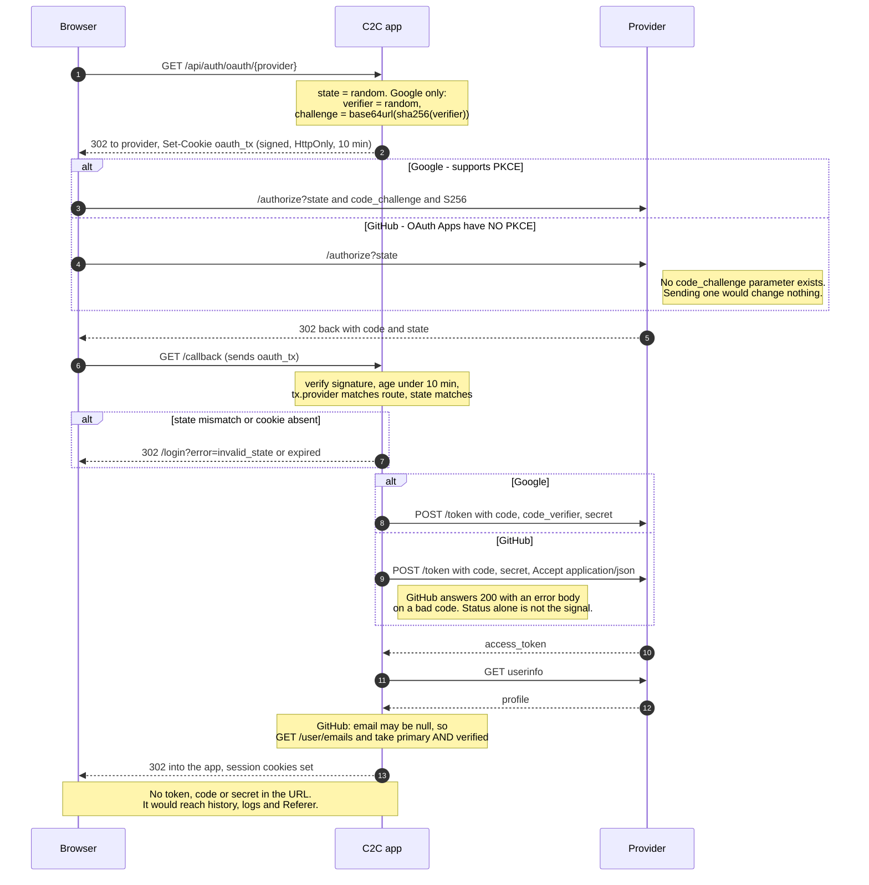
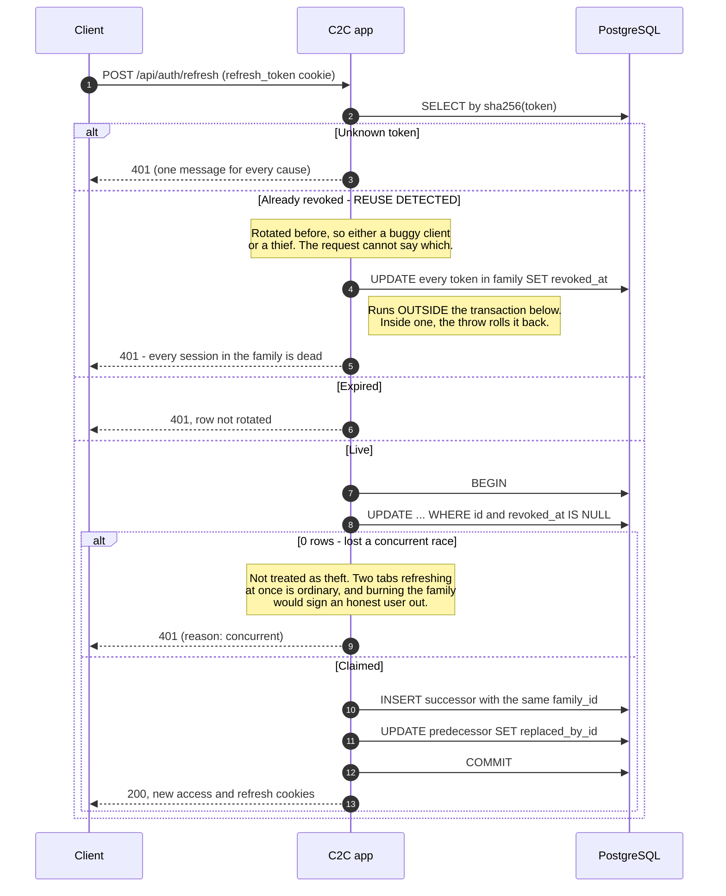

# Threat model — `iteh-c2c-ecommerce`

Produced by **C2C-SEC-12**, covering the work in the `C2C-SEC` epic. Every mitigation
below names the file that implements it and the test that proves it, so a reviewer can
check the claim rather than take it.

Companion document: [`rbac-matrix.md`](./rbac-matrix.md).

## 1. Assets

| Asset | Why it matters |
|---|---|
| Session credentials (access token, refresh token) | Possession *is* authentication |
| Password hashes | bcrypt at 12 rounds; a leak is offline-crackable at leisure |
| External identities (`oauth_accounts`) | The join between a provider account and a local one |
| Order and review data | Buyers' purchase history is personal |
| Listing inventory, including `sold`/`removed` | A seller's unpublished state is commercially sensitive |
| Groq API quota | Real money, spent per request |

## 2. Trust boundaries

```
  Browser  ──(1)──▶  Next.js route handlers  ──(2)──▶  PostgreSQL
     │                       │
     └───────(3)───────▶  Google / GitHub / Groq
```

**(1) Untrusted.** Every value from a browser — body, query, cookie, header — is attacker
controlled. Cookies are signed or opaque; ids come from the token, never the body.

**(2) Trusted, but least-privilege.** One connection string; no row-level security. The
application is the only enforcement point, which is why SEC-10's checks are central
rather than scattered per route.

**(3) Semi-trusted.** Providers are honest about protocol mechanics and *not* authoritative
about identity: a provider-supplied email address is a claim, not proof.

## 3. Threats and mitigations

### T1 — Token theft via XSS

An injected script reads a token and replays it.

**Mitigation.** No token is reachable from JavaScript. Both `auth_token` and
`refresh_token` are `HttpOnly`; the access token's life is 15 minutes.
`src/lib/cookies.ts`, `src/lib/refresh-cookies.ts`.

**Proof.** `cookies.test.ts` asserts `httpOnly`; `api.test.ts` "touches no browser
storage"; `refresh/route.integration.test.ts` reads attributes from the raw `set-cookie`
header rather than a friendlier API that could hide a missing flag.

**Residual.** A script can still *use* the session by issuing same-origin requests. Only
a shorter window and a Content-Security-Policy reduce that; CSP is not in this backlog.

### T2 — Refresh-token theft

A refresh token is exfiltrated and used to mint sessions indefinitely.

**Mitigation.** Single-use rotation with family reuse detection. Presenting an
already-rotated token means either a buggy client or a thief, and the request cannot say
which — so the entire family is revoked and both parties must log in again.
`src/lib/refresh-token.ts`.

**Proof.** `refresh-token.integration.test.ts` AC6 "replaying a rotated token revokes
every token in its family", and "does not touch a different family belonging to the same
user".

**Note for the thesis.** The revocation runs *outside* the rotation transaction. Written
inside one, the `throw` that accompanies it rolls the revocation straight back: the
family looks burned to the code that wrote it and stays live for everyone else. The AC6
test caught exactly that.

### T3 — Cross-site request forgery

A third-party page issues a state-changing request on a logged-in user's behalf.

**Mitigation.** `SameSite=Lax` on both session cookies, so the browser withholds them
from cross-site `POST`/`PUT`/`DELETE`. `Lax` rather than `Strict` because the OAuth
callback is a top-level cross-site navigation, and `Strict` would withhold the cookie on
exactly the request that needs it.

**Proof.** `cookies.test.ts`, `refresh/route.integration.test.ts` AC1.

**Residual.** `Lax` still permits top-level cross-site `GET`. No route mutates on `GET`.
This is not a substitute for CSRF tokens if the app ever accepts genuine cross-site form
posts.

### T4 — Open redirect

`returnTo` sends the user to an attacker's origin after login.

**Mitigation.** `safeReturnTo` allows exactly one shape — a single leading slash not
followed by another slash or a backslash — and rejects rather than sanitises.
`src/lib/oauth/return-to.ts`.

**Proof.** `return-to.test.ts` covers `//evil.test`, `/\evil.test`, `javascript:` and
control-character prefixes; `link-account/page.component.test.tsx` is a regression test.

**Note.** This was found by review *after* the predicate had been written correctly. It
was applied on the server and not on the client, so `/link-account?returnTo=https://evil.test`
worked. A guard is only as good as its call sites — and the predicate's own unit tests
were added at the same time as the fix, because until then it had only ever been covered
indirectly through the routes that happened to use it.

### T5 — Account takeover via unverified email

A provider hands over an unverified `victim@example.com` and the flow attaches it to the
victim's existing account.

**Mitigation.** Decision D9. An unverified provider email never links and never seeds an
account. A *verified* collision does not auto-link either: it issues a ten-minute signed
challenge and requires the existing account's password.
`src/app/api/auth/oauth/[provider]/callback/route.ts`, `src/app/api/auth/oauth/link/route.ts`.

**Proof.** `link.integration.test.ts` AC4 (unverified never links), AC1–AC3 (password
required; a wrong password answers exactly like a failed login, so the screen cannot
become a password oracle), `providers.test.ts` AC8 (Google's `email_verified` is read,
never assumed true).

### T6 — Privilege escalation

A caller grants themselves a role they were not given.

**Mitigation.** `role` is whitelisted to `buyer`/`seller` at registration, hard-coded to
`buyer` on OAuth account creation, and admin-only on `PUT /api/users/{id}` — including on
your own record.

**Proof.** `privilege-escalation.integration.test.ts`, verified red by widening the enum
and watching AC1 and AC2 fail.

### T7 — Brute force

Password or `state` guessing at machine speed.

**Mitigation.** Sliding-window limits on login, register, refresh, both OAuth routes and
the link screen. `src/lib/rate-limit.ts`; the policy table is in `README.md`.

**Proof.** `rate-limits.integration.test.ts`, `rate-limit.test.ts`,
`rate-limit-headers.test.ts`.

**Residual.** The limiter is in-memory and per instance — see §4.

### T8 — OAuth `state` and PKCE replay

An attacker injects their own authorization code, or replays an intercepted one.

**Mitigation.** A random `state` per request, bound to a signed `HttpOnly` cookie that
carries its own issued-at and is rejected past ten minutes — the cookie's `Max-Age` is
not a control, because a client decides whether to honour it. Google additionally gets
PKCE `S256`.

**Proof.** `pkce-state.test.ts`, `providers.test.ts`, `oauth/route.integration.test.ts`
AC3/AC4.

**The asymmetry, which is the finding worth citing.** **GitHub OAuth Apps do not support
PKCE.** There is no `code_challenge` parameter, and sending one changes nothing. So Google
gets PKCE *and* `state`; GitHub gets `state` *and* the client secret. A shared
"PKCE for everyone" helper would have produced a code path that looks protected on GitHub
and is not. `supportsPkce` sits on the provider interface so a caller can see which it
holds, and the spec pins the difference in **both** directions — Google must send a
challenge, GitHub must not — so nobody later removes the duplication and silently deletes
a control.

### T9 — Information disclosure through error behaviour

Status codes, messages, or response timing reveal what exists or who has an account.

**Mitigations.**

- `GET /api/orders/{id}` answers **404** for another user's order, byte-identical to the
  genuinely-missing case. A 403 on a sequential id is an enumeration oracle.
- `PUT /api/orders/{id}` settles ownership *before* order state. The other order returns
  "Only pending orders can be approved" to a seller with no stake in the order, which is
  a fact about someone else's purchase.
- Password login against an OAuth-only account compares a decoy bcrypt hash, so it costs
  what a real check costs. Returning early would make those accounts answer visibly
  faster and reveal which addresses authenticate elsewhere.
- Refresh and OAuth failures give one message for every cause.

**Proof.** `rbac.integration.test.ts` AC3 and "checks ownership before order state, so a
stranger cannot read the status"; `oauth-only.integration.test.ts` "takes comparable time
to a real password check, so timing reveals nothing".

### T10 — Malicious file upload

`POST /api/listings/{id}/images` is a new trust boundary Part 2 introduces: untrusted
bytes from the browser cross into a filesystem (or object store). A crafted file could
try to masquerade as an image to reach a decoder vulnerability, smuggle a polyglot payload
that renders as something else when served back, exhaust memory by claiming a small
compressed size but an enormous decoded one, or carry EXIF data — including GPS
coordinates a phone camera attaches — straight through to other users.

**Mitigation.** Type is decided by **magic bytes**, never the multipart `Content-Type`
header or filename — both are attacker-controlled and worth nothing. Every accepted file
is unconditionally re-encoded to WebP with `sharp`: a decode-then-encode cycle cannot
carry a polyglot through, and re-encoding drops EXIF as a side effect, including GPS.
`sharp`'s `limitInputPixels` bounds the *decoded* size separately from the *compressed*
size checks, since a small file can still decode to hundreds of megapixels. Storage keys
are server-generated random hex — the client's filename never reaches a path join — and
every driver validates a key against `isValidStorageKey` before touching its backing
store, so a key that somehow reached the database through a future bug still cannot
escape the storage root. `src/lib/image-type.ts`, `src/app/api/listings/[id]/images/route.ts`,
`src/lib/storage.ts`.

**Proof.** `image-type.test.ts` (magic-byte sniffing, including the GIF-decodes-fine-but-
rejected case); `[id]/images/route.integration.test.ts` "rejects a file whose bytes are
not an image, whatever it claims", "refuses a GIF, which decodes fine but is outside the
accepted list", and "never lets the client's filename reach the storage key";
`storage.test.ts` and `storage-contract.test.ts` for `isValidStorageKey`.

## 4. Known limitations

| Limitation | Status |
|---|---|
| Rate limiting is in-memory and per instance — on N instances the effective limit is `N × limit` | Accepted for a single Railway instance. Redis deferred, backlog §6 |
| No 2FA | Deferred, backlog §6 |
| `email_verified = false` for every legacy password account | Correct, not a gap: this app has never run a verification flow, and claiming otherwise would be a falsehood that SEC-8's linking policy then trusts |
| No email verification flow for password signup | Deferred, backlog §6. OAuth users are verified by their provider |
| Logout does not invalidate an access token already copied out of the cookie | Accepted: it expires within 15 minutes. Closing it needs a `jti` blocklist or a `tokenVersion` column checked in `authenticate()` |
| No Content-Security-Policy | Not in this backlog. Would reduce T1's residual risk |
| No session-management UI ("sign out other devices") | `revokeRefreshTokenFamily` exists; only the screen is missing. Deferred, backlog §6 |

## 5. Sequence diagrams

### Authorization code with PKCE, and where GitHub differs



### Refresh rotation, including the reuse-detection branch



## 6. Verifying this document

Every mitigation above names a test. To run the whole set:

```bash
cd c2c-e-commerce && npm run test
```
